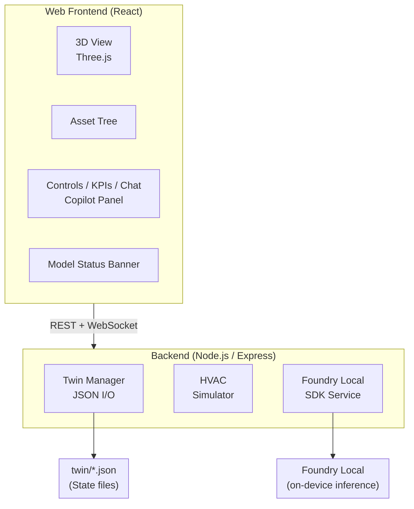

# Smart Building HVAC Digital Twin

[](LICENSE)
[](https://nodejs.org/)
[](https://reactjs.org/)
[](https://threejs.org/)

A web-based digital twin demo for multi-floor office building HVAC operations, featuring:
- **JSON-based twin state** as the single source of truth
- **Deterministic HVAC simulator** with physics-based models
- **AI-powered Operations Copilot** for natural language building control
- **Interactive 3D visualisation** with React + Three.js
- **Comprehensive fault injection** for testing and diagnostics
- **Real-time controls and KPIs**


## Features

### 🏢 Building Simulation
- Multi-zone thermal modelling
- VAV and AHU simulation
- Chiller, boiler, and pump dynamics
- CO2 and air quality modelling

### 🤖 AI Copilot
- Natural language queries about building status
- Execute commands: "Set lobby temp to 72"
- Run simulations: "Advance 30 minutes"
- Inject faults for testing

### ⚡ Fault Injection
- 20+ fault scenarios for testing:
  - Plant failures (chiller, boiler, pumps)
  - AHU failures (fan, coil freeze, economizer)
  - VAV failures (stuck damper, reheat)
  - Sensor failures (drift, complete failure)
  - Communication and power failures

### 📊 KPIs & Monitoring
- Energy consumption and cost
- Comfort compliance
- Air quality (CO2) tracking
- Equipment efficiency

## Architecture



## Quick Start

### Prerequisites
- Node.js 20+ ([download](https://nodejs.org))
- Foundry Local (optional, for AI copilot features): [install instructions](https://foundrylocal.ai)
- On Windows (PowerShell), ensure the current user can execute `C:\Program Files\nodejs\npm.ps1` without a digital signature (see tip below).
> [!TIP]
> If you get an error like the following:
> 
> npm : File C:\Program Files\nodejs\npm.ps1 cannot be loaded. The file C:\Program Files\nodejs\npm.ps1 is not digitally
> signed. You cannot run this script on the current system. For more information about running scripts and setting
> execution policy, see about_Execution_Policies at https:/go.microsoft.com/fwlink/?LinkID=135170.
>
> Then please set
> ```powershell
> Set-ExecutionPolicy -Scope CurrentUser -ExecutionPolicy RemoteSigned
> ```

### Option A: Manual Startup (Recommended)

Open **two separate terminals** and run:

**Terminal 1 - Backend:**
```powershell
cd c:\path\to\DigitalTwin\backend
npm install
node src/index.js
```

**Terminal 2 - Frontend:**
```powershell
cd c:\path\to\DigitalTwin\frontend
npm install
npm run dev
```

Then open http://localhost:3000 in your browser.

### Option B: Using Startup Scripts

From the project root directory:

**PowerShell:**
```powershell
cd c:\path\to\DigitalTwin
.\start-demo.ps1
```

**Command Prompt:**
```cmd
cd c:\path\to\DigitalTwin
start-demo.bat
```

The scripts will:
1. Check Node.js installation
2. Install dependencies (if needed)
3. Reset twin state to baseline
4. Open two terminal windows (backend + frontend)
5. Open browser automatically

**Script Options (PowerShell):**
```powershell
.\start-demo.ps1 -SkipInstall      # Skip dependency check
.\start-demo.ps1 -BackendOnly      # Start only backend
.\start-demo.ps1 -FrontendOnly     # Start only frontend
.\start-demo.ps1 -NoBrowser        # Don't open browser
```

### Option C: With Foundry Local (AI Features)

The backend uses the `foundry-local-sdk` npm package to manage AI models on-device. No separate CLI setup is required.

1. Install the SDK (already included in backend dependencies):
   ```powershell
   cd backend
   # Windows
   npm install --foreground-scripts --winml foundry-local-sdk
   # macOS / Linux
   npm install --foreground-scripts foundry-local-sdk
   ```
2. Start the backend as above. The SDK will automatically download and load the `phi-3.5-mini` model on first run.
3. A **model status banner** in the UI shows download progress, loading state, and readiness.

To use a different model, set the `FOUNDRY_MODEL` environment variable before starting:
```powershell
$env:FOUNDRY_MODEL = 'qwen2.5-0.5b'
node src/index.js
```

## Features

### 3D Building Visualisation
- Interactive 3D view of zones, AHUs, chiller, and boiler
- Colour-coded zones by temperature and CO₂ levels
- Click to select assets and view details
- Real-time updates as simulation runs

### Control Panel
- Adjust zone temperature setpoints
- Modify AHU supply air temperature
- Activate demand response levels
- Run simulation steps manually

### KPIs Dashboard
- **Energy**: Total power, daily energy, cost estimate
- **Comfort**: Temperature deviation, compliance %
- **IAQ**: CO₂ levels, ventilation adequacy
- **Operational**: Filter life, chiller efficiency

### Alert Management
- Automatic fault detection (CO₂, temperature, filter loading)
- Acknowledge and track alerts
- Recommended actions for each alert

### AI Copilot (Foundry Local)
- Ask questions about building performance
- Get grounded explanations citing actual data
- Receive optimisation recommendations
- Falls back to rule-based responses if SLM unavailable

## API Reference

### Twin State

```
GET  /api/twin              - Get complete twin state
GET  /api/twin/assets       - Get all assets
GET  /api/twin/telemetry    - Get telemetry (filter by ?assetId=&pointType=)
GET  /api/twin/controls     - Get controls
PUT  /api/twin/controls/:id - Update control value
GET  /api/twin/kpis         - Get KPIs
GET  /api/twin/alerts       - Get alerts (?active=true for active only)
PUT  /api/twin/alerts/:id/acknowledge - Acknowledge alert
```

### Simulation

```
POST /api/twin/simulate     - Run simulation step
POST /api/twin/fault        - Apply fault scenario
POST /api/twin/reset        - Reset to baseline state
GET  /api/twin/explain/:id  - Get explanation for KPI or alert
```

### Copilot

```
POST /api/copilot/chat      - Send message to AI copilot
```

### Model Status

```
GET  /api/model/status      - Get AI model download/loading status
```

Model status updates are also pushed via WebSocket (`type: 'model_status'`).

## Reset Twin State

To reset the digital twin to its baseline state:

**Via API:**
```bash
curl -X POST http://localhost:3001/api/twin/reset
```

**Via UI:**
Click "Reset to Baseline" button in the Controls panel.

## Running Tests

### Full Test Suite

Run all tests from the project root:

**PowerShell:**
```powershell
cd tests
.\run-all-tests.ps1
.\run-all-tests.ps1 -Verbose        # Show detailed output
.\run-all-tests.ps1 -BackendOnly    # Run only backend tests
.\run-all-tests.ps1 -ValidationOnly # Run only validation tests
```

**Command Prompt:**
```cmd
cd tests
run-all-tests.bat
```

### Backend Simulator Tests

```bash
cd backend
npm test
```

Tests cover 5 impact scenarios:
1. Raise cooling setpoint → energy reduction
2. Increase occupancy → CO₂ rise
3. Filter loading → increased fan power
4. Demand response → energy/comfort tradeoff
5. Stuck VAV damper → zone anomaly + alert

### Test Categories

| Category | Description | Location |
|----------|-------------|----------|
| **API Tests** | REST endpoint validation | `tests/backend/api.test.js` |
| **WebSocket Tests** | Real-time connectivity | `tests/backend/websocket.test.js` |
| **Simulator Tests** | HVAC physics validation | `backend/tests/simulator.test.js` |
| **E2E Tests** | End-to-end workflows | `tests/integration/e2e.test.js` |
| **Data Flow Tests** | Data consistency checks | `tests/integration/data-flow.test.js` |
| **Schema Tests** | JSON schema validation | `tests/validation/twin-schema.test.js` |
| **Health Checks** | System availability | `tests/validation/health-check.test.js` |

### Prerequisites for Integration Tests

- Backend server must be running on port 3001
- Frontend server must be running on port 3000 (for full E2E)

Start servers first:
```powershell
.\start-demo.ps1
```
Then run tests in another terminal.

## Project Structure

```
digitaltwin/
├── start-demo.ps1          # PowerShell startup script
├── start-demo.bat          # Batch startup script
├── frontend/               # React web application
│   ├── src/
│   │   ├── components/     # UI components
│   │   ├── hooks/          # State management (Zustand)
│   │   └── App.jsx         # Main application
│   └── package.json
├── backend/                # Node.js API server
│   ├── src/
│   │   ├── services/       # Foundry Local SDK + copilot service
│   │   ├── simulator/      # HVAC physics simulator
│   │   ├── routes/         # API routes
│   │   └── index.js        # Express server
│   ├── tests/              # Backend unit tests
│   └── package.json
├── tests/                  # Comprehensive test suite
│   ├── run-all-tests.ps1   # Test runner (PowerShell)
│   ├── run-all-tests.bat   # Test runner (Batch)
│   ├── backend/            # API & WebSocket tests
│   ├── integration/        # E2E & data flow tests
│   └── validation/         # Schema & health checks
├── twin/                   # Digital twin data
│   ├── twin.schema.json    # JSON schema definition
│   ├── twin.baseline.json  # Initial/reset state
│   └── twin.state.json     # Current live state
├── assets/                 # 3D models (GLB files)
└── docs/                   # Documentation
```

## Building Model

The digital twin models a 3-floor office building:

- **Floor 1**: Lobby + Mechanical Room
- **Floor 2**: Open Office + 2 Conference Rooms
- **Floor 3**: Open Office + Executive Suite

**HVAC System:**
- 2 Air Handling Units (AHU-1 serves F1-2, AHU-2 serves F3)
- 6 VAV boxes (one per zone)
- 200-ton Chiller
- 2M BTU Boiler
- CHW and HW pumps

## Simulator Physics

### Zone Thermal Model (1R1C)
```
dT/dt = (Q_internal - Q_cooling) / C_thermal
```

### CO₂ Mass Balance
```
dCO₂/dt = (G_people × occupancy - V_oa × ΔCO₂) / Volume
```

### Fan Power (Affinity Laws)
```
P = P_rated × (speed / 100)³ × filter_factor
```

### Chiller COP
```
COP = COP_design × f(part_load) × f(condenser_temp)
```

## Licence

MIT
