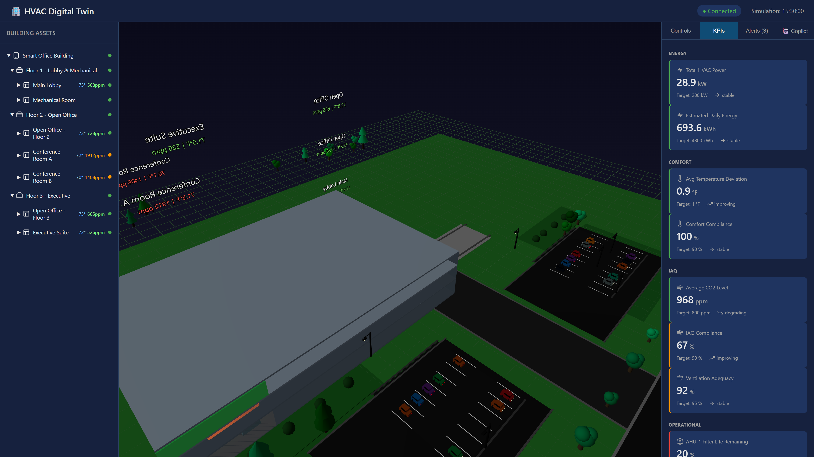
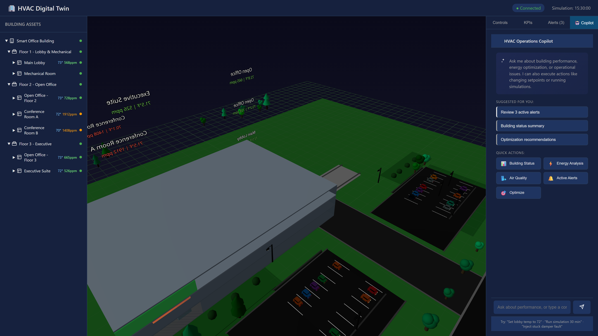
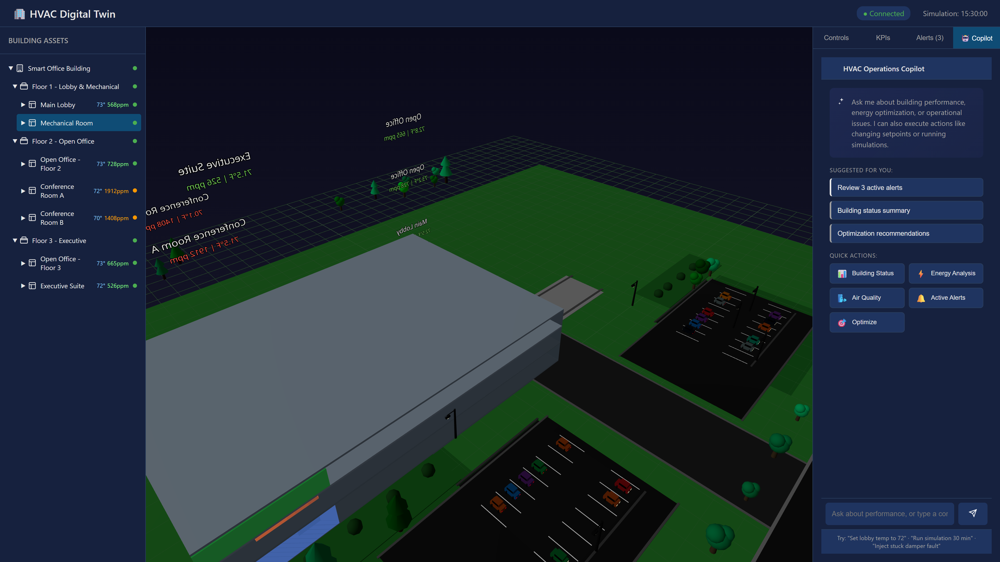
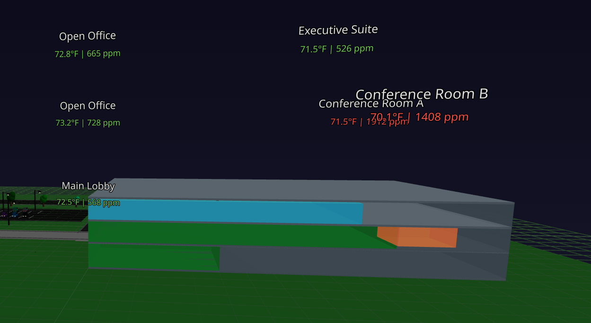
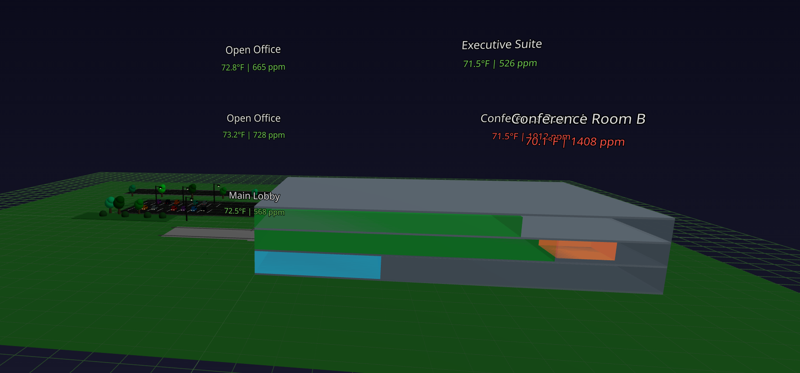

# Building a Digital Twin Campus with SLM-Assisted Ops

This post walks through how the DigitalTwin app in this repo is assembled and how small language models (SLMs) complement a digital twin for operational workflows. It’s aimed at developers who want to understand the architecture, not just click a demo.

## What the app does

At a high level, the app renders a 3D facility, streams telemetry into a live twin graph, and exposes a chat/assistant surface that can summarize current conditions or guide operators to relevant assets. The UI is split into:

- A 3D viewport with the building scene and assets.
- An asset tree for exploring the twin graph.
- KPI panels and alerts for quick status.
- A copilot-style chat panel for natural-language workflows.

## How it’s built

### Frontend (React + Three.js)

The frontend lives in the frontend/ folder and uses React with @react-three/fiber and @react-three/drei to render the 3D scene. The building can be loaded from a GLB model when available, falling back to procedural geometry if the model isn’t present. That fallback still renders floors, zones, HVAC assets, and the campus landscape.

Key pieces:

- Scene composition in BuildingScene: zones, equipment, and landscape.
- UI panels in App and components/ (asset tree, KPIs, alerts, chat).
- Twin state consumption via a shared store (hooks/useTwinStore).

**Rendering details:**

- The building is loaded from a GLB when present; otherwise a procedural fallback draws floors, zone volumes, and HVAC equipment.
- Zone overlays are derived from live telemetry (temperature/CO₂) to drive color and labels.
- Camera/controls are tuned for “campus + building + lots” visibility in one frame.

### Backend (Node.js)

The backend provides API routes, real-time telemetry, and simulation services. It exposes endpoints for the twin graph and streams updates to the UI. The simulator produces HVAC telemetry that flows into the twin, which the UI renders and the assistant can interpret.

Key runtime paths:

- REST: /api/twin and /api/copilot endpoints for state, KPIs, and assistant chat.
- WebSocket: pushes periodic telemetry updates to the UI.
- Simulator: advances time, injects faults, and calculates KPIs (energy, IAQ, comfort).

### Tests

The tests/ folder includes API, WebSocket, integration, and validation suites to keep the twin schema and data flow consistent.

## Digital twins in practice

A digital twin is a structured representation of assets and their relationships, with live telemetry tied to the model. In this app, the twin data includes floors, zones, and HVAC equipment, all connected in a graph. The UI can select an asset and the rest of the app updates contextually (status colors, KPI panels, alerts, and chat context).

Why it matters:

- Consistent identifiers across UI, telemetry, and analytics.
- Clear relationships (zone → floor → building) for navigation and impact analysis.
- A foundation for automation and analytics beyond visualization.

### Telemetry and KPI flow

The simulator produces per-asset telemetry points (e.g., temperature, CO₂, power). KPIs are computed from those points and displayed in the UI. The asset tree and 3D overlays stay in sync because they share the same asset IDs and mesh IDs.

## Where SLMs fit

Small language models (SLMs) are compact models optimized for lower latency and cost. They excel at structured reasoning over the twin graph and summarizing telemetry, while keeping deployment lightweight.

Typical SLM tasks in this app:

- Summarize current system health from live telemetry.
- Explain why a zone is flagged (e.g., temp/CO2 thresholds).
- Route users to the right asset based on natural language.
- Generate concise operator steps without needing a large model.

SLMs are a good fit for deterministic, high-frequency operational tasks where responsiveness and cost matter more than broad world knowledge.

## Foundry Local integration

This app uses Foundry Local as a local inference endpoint for copilot responses. The backend calls the local chat completions API, sends a structured system prompt grounded in the twin state, and falls back to rule-based responses if the model is unavailable.

**Configuration:**

- Endpoint: http://localhost:5272 (FOUNDRY_LOCAL_URL)
- Model: phi-3-mini (selected for low latency and cost)
- Request settings: temperature 0.7, max_tokens 1024

**Why this model selection:**

- Sufficient for short, grounded operational guidance.
- Fast enough for frequent operator interactions.
- Small footprint for local demos and dev environments.

If you swap models, keep the same chat completion schema and tune temperature/length based on response style and latency targets.

## Putting it together

The combination of a digital twin and SLM-powered assistance creates a feedback loop:

1. Telemetry updates the twin graph.
2. The UI reflects state changes in the 3D scene and KPIs.
3. The assistant queries the twin and summarizes impacts or suggested actions.

That loop turns the app into more than a visualization — it becomes an operational interface.

## Screenshots

## Next steps

If you want to extend this app:

- Add domain-specific asset types (elevators, lighting, security).
- Plug in real telemetry sources instead of the simulator.
- Add agent workflows (incident triage, energy optimization, maintenance scheduling).

Developers can start by exploring BuildingScene for 3D context, the twin schema in twin/, and the backend simulator to understand how live data drives the experience.
