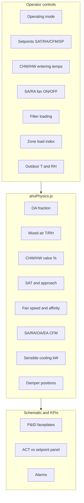

# AHU01 — Controls, Formulas & Parameter Relationships

**Unit:** AHU01 (1F recirculation AHU)  
**Physics core:** [`frontend/src/services/ahuPhysics.js`](../frontend/src/services/ahuPhysics.js)  
**Simulation engine:** [`frontend/src/services/ahuEngine.ts`](../frontend/src/services/ahuEngine.ts)  
**UI controls:** right sidebar → **Controls** tab (`AhuControlPanel.jsx`)  
**Control metadata:** [`frontend/src/components/ahu/ahuControlMeta.js`](../frontend/src/components/ahu/ahuControlMeta.js)  
**Validation:** [`tests/validation/ahu/ahu-physics.test.mjs`](../tests/validation/ahu/ahu-physics.test.mjs)  
**Broader formula catalog:** [`physics-formulas-reference.md`](physics-formulas-reference.md) §3.1–3.2

---

## 1. Overview

The AHU01 twin is a **quasi-steady airside model** with first-order zone lag:

- **Return path (RA):** room → RA fan → EU-7 filter → fire damper → exhaust / recirc.  
- **Supply path (SA):** outdoor + return mix → EU-4 → CHW coil → HW coil → SA fan → EU-7 → EU-13 → room.  
- **Controls:** operator sliders in the right panel feed `solveAhu01Airside()` each 2 s tick.  
- **Schematic:** faceplate tags (CFM, POS %, VALVE %, SPD %) are **calculated outputs**, not direct sliders.



---

## 2. Controllable parameters

| Control ID | Panel label | Range | Unit | Group |
|------------|-------------|-------|------|-------|
| `ahu-mode` | Operating Mode | Recirculation / Min OA / Economizer / Heating | — | Operating mode |
| `ahu-sat-sp` | SAT Setpoint | 10 – 18 | °C | Setpoints |
| `ahu-ra-temp-sp` | RA Temp Setpoint | 20 – 28 | °C | Setpoints |
| `ahu-ra-rh-sp` | RA RH Setpoint | 40 – 70 | % | Setpoints |
| `ahu-sa-cfm-sp` | SA Airflow Setpoint | 800 – 3500 | CFM | Setpoints |
| `ahu-ra-cfm-sp` | RA Airflow Setpoint | 600 – 2500 | CFM | Setpoints |
| `ahu-sp-sp` | Static Pressure SP | 400 – 900 | Pa | Setpoints |
| `ahu-chw-enter` | CHW Entering Temp | 4 – 12 | °C | Coils (boundary) |
| `ahu-hw-enter` | HW Entering Temp | 35 – 70 | °C | Coils (boundary) |
| `ahu-sa-fan` | SA Fan Command | ON / OFF | — | Fans |
| `ahu-ra-fan` | RA Fan Command | ON / OFF | — | Fans |
| `ahu-filter-load` | Filter Loading | 0 – 100 | % | Filters & dampers |
| `ahu-zone-load` | Zone Load Index | 0.3 – 1.5 | — | Zone load |
| `ahu-oat` | Outdoor Temperature | 5 – 42 | °C | Weather |
| `ahu-oarh` | Outdoor Humidity | 20 – 95 | %RH | Weather |

### Schematic-only (derived, not slider-controlled)

| Schematic tag | Source |
|---------------|--------|
| FA/EA Damper POS % | OA fraction and exhaust balance |
| RA Damper POS % | Complement of OA damper |
| CHW / HW VALVE % | Cooling/heating demand logic |
| SA / RA fan SPD % | Setpoints + static pressure + filter |
| RA/SA CFM, T&RH sensors | Physics outputs + zone lag |
| Fire damper | Fixed open (100 %) unless fire alarm added |

---

## 3. Core physics formulas

These are **expert-standard** relations implemented in code.

### 3.1 Sensible cooling load (air side)

**Imperial (ASHRAE standard air):**

\[
\dot{Q}_\text{sensible}\;[\text{Btu/h}] = \dot{V}\;[\text{CFM}] \times 1.08 \times \Delta T\;[°F]
\]

Constant **1.08** = \(\rho \times c_p \times 60 = 0.075\;\text{lb/ft³} \times 0.24\;\text{Btu/(lb·°F)} \times 60\;\text{min/h}\).

**Metric (code: `coolingKwFromCfm`):**

\[
\dot{Q}\;[\text{kW}] = 0.0167 \times \text{CFM} \times \Delta T\;[°C]
\]

where \(\Delta T = T_\text{MAT} - T_\text{SAT}\).

**Source:** ASHRAE *Fundamentals* (2021) Ch. 1 — Psychrometrics.

### 3.2 Fan affinity laws

\[
\frac{Q_2}{Q_1} = \frac{N_2}{N_1}, \qquad
\frac{H_2}{H_1} = \left(\frac{N_2}{N_1}\right)^2, \qquad
\frac{P_2}{P_1} = \left(\frac{N_2}{N_1}\right)^3
\]

Code uses \(P_\text{fan} = P_\text{ref} \times (N/N_\text{ref})^3\) (`fanKwFromSpeed`).

**Source:** ASHRAE *Fundamentals* Ch. 21 (Fans); Hydraulic Institute affinity laws.

### 3.3 Mixed air (mixing box)

\[
T_\text{MAT} = f_\text{OA} \cdot T_\text{OA} + (1 - f_\text{OA}) \cdot T_\text{RA}
\]

\[
RH_\text{MAT} \approx f_\text{OA} \cdot RH_\text{OA} + (1 - f_\text{OA}) \cdot RH_\text{RA}
\]

(Linear RH blend is a simplified surrogate; exact psychrometrics uses humidity ratio \(W\).)

**Source:** ASHRAE *Fundamentals* Ch. 1 — adiabatic mixing.

### 3.4 Airflow mass balance

\[
\dot{V}_\text{OA} = \dot{V}_\text{SA} \times f_\text{OA}
\]

\[
\dot{V}_\text{EA} = \max\left(0,\; \dot{V}_\text{SA} - \dot{V}_\text{RA} \times (1 - f_\text{OA})\right)
\]

**Source:** Steady-state continuity; ASHRAE 62.1 ventilation principles.

### 3.5 CHW side energy balance

\[
\dot{Q} = \dot{m}_w \cdot c_p \cdot \Delta T_w
\]

\[
T_\text{CHW,leave} = T_\text{CHW,enter} + \frac{\dot{Q}}{\dot{m}_w \cdot c_p}
\]

**Source:** ASHRAE *Fundamentals* Ch. 4 — heat transfer.

### 3.6 Zone thermal lag (dynamic, 2 s ticks)

\[
T_\text{RA}(k+1) = T_\text{RA}(k) + \bigl(T_\text{target} - T_\text{RA}(k)\bigr) \times 0.12
\]

\[
RH_\text{RA}(k+1) = RH_\text{RA}(k) + \bigl(RH_\text{target} - RH_\text{RA}(k)\bigr) \times 0.10
\]

\[
T_\text{target} = T_\text{RA,SP} + 1.2 \times \text{zoneLoad}, \qquad
RH_\text{target} = RH_\text{RA,SP} + 18 \times \text{zoneLoad}
\]

**Source:** First-order RC model — ASHRAE *Fundamentals* Ch. 7 (Control).

---

## 4. Engine-level correlations (calibrated heuristics)

These tie the model to the BMS baseline screenshot; they are **simplified BMS emulation**, not full coil NTU-LMTD models.

| Model | Expression | Purpose |
|-------|------------|---------|
| OA fraction by mode | Recirc 5%, Min OA 15%, Econ \(\text{clamp}(0.10 + (T_{RA}-T_{OA})/40)\), Heat 12% | Mode logic |
| Cooling demand | \(\text{clamp}(0.4\, e_T + 0.03\, e_{RH}, 0, 1.35) \times \text{zoneLoad}\) | CHW valve |
| CHW valve | \(\text{clamp}(18 + 72 \times \text{coolingDemand}, 0, 100)\) % | Coil control |
| Coil approach | \((T_{MAT} - SAT_{SP}) \times (1 - valve/110)\) | SAT calculation |
| SA fan speed | f(SA CFM SP, SP SP, filter, cooling demand) | Affinity input |
| CFM vs speed | \(CFM = CFM_\text{design} \times (speed/100)^{0.85} \times filterFactor\) | System curve |
| Static pressure | \(SP \approx SP_{SP} \times (speed/100)^{1.8}\) | Duct pressure |
| Filter penalty | \(filterFactor = 1 - 0.003 \times loading\%\); \(\Delta P = 50 + 4.5 \times loading\%\) | Filter DP |
| Damper POS | OA % = \(f_{OA} \times 100 + 5\); RA % = \(100 - OA + 10\) | Faceplate tags |
| HW valve | Heating mode or cold-OAT trim | HW coil |

**BMS baseline (recirculation):** RA 25.1 °C / 74.4 %RH, SA ~2555 CFM, CHW valve ~100%, RA CFM ~1235 CFM.

---

## 5. Parameter relationships — “if you change X, what happens?”

### 5.1 Operating Mode (`ahu-mode`)

| Mode | OA fraction | Typical effect |
|------|-------------|----------------|
| Recirculation | ~5 % | Minimal OA, max recirc, baseline BMS |
| Minimum OA | ~15 % | More ventilation, cooler MAT in hot weather |
| Economizer | f(\(T_{RA} - T_{OA}\)) | Free cooling when OAT < RA |
| Heating | ~12 % OA, HW active | HW valve opens, CHW closes |

**Downstream:** MAT, SAT, OA/RA damper POS, OA/EA CFM, CHW/HW valves.

### 5.2 SAT Setpoint (`ahu-sat-sp`) ↓

| Affected | Direction | Mechanism |
|----------|-----------|-----------|
| SAT | ↓ | Approach tied to SP |
| CHW valve % | ↑ | More cooling needed |
| Cooling kW | ↑ | Larger \(\Delta T\) across coil |
| Comfort | ↑ cooling | Lower supply temp |

### 5.3 RA Temp Setpoint (`ahu-ra-temp-sp`) ↓

| Affected | Direction | Mechanism |
|----------|-----------|-----------|
| \(e_T = T_{RA} - SP\) | ↑ if RA fixed | Error drives demand |
| CHW valve % | ↑ | coolingDemand term |
| Fan speed trim | ↑ | fanDemandBoost |
| Zone lag target | ↓ | \(T_{target} = SP + 1.2 \times load\) |

### 5.4 RA RH Setpoint (`ahu-ra-rh-sp`) ↓

| Affected | Direction | Mechanism |
|----------|-----------|-----------|
| \(e_{RH}\) | ↑ if RA RH fixed | Humidity error |
| CHW valve % | ↑ | Dehumidification demand |
| Zone lag RH target | ↓ | \(RH_{target} = SP + 18 \times load\) |

### 5.5 SA Airflow Setpoint (`ahu-sa-cfm-sp`) ↑

| Affected | Direction | Mechanism |
|----------|-----------|-----------|
| SA fan SPD % | ↑ | Speed from SP ratio |
| SA CFM | ↑ | \(CFM \propto speed^{0.85}\) |
| Cooling kW | ↑ | More air × same \(\Delta T\) |
| Fan kW | ↑ | \(P \propto N^3\) |
| Static pressure | ↑ | Speed-pressure correlation |

### 5.6 RA Airflow Setpoint (`ahu-ra-cfm-sp`) ↑

| Affected | Direction | Mechanism |
|----------|-----------|-----------|
| RA fan SPD % | ↑ | RA speed trim |
| RA CFM | ↑ | Return path flow |
| Building ΔP (SA−RA) | Changes | Pressurization |
| EA CFM | May ↓ | Less exhaust relative to SA |

### 5.7 Static Pressure SP (`ahu-sp-sp`) ↑

| Affected | Direction | Mechanism |
|----------|-----------|-----------|
| SA fan speed % | ↑ | Higher SP setpoint |
| Static pressure Pa | ↑ | \(\Delta P \propto speed^{1.8}\) |
| SA CFM | ↑ | Fan works harder |

### 5.8 CHW Entering Temp (`ahu-chw-enter`) ↓

| Affected | Direction | Mechanism |
|----------|-----------|-----------|
| Coil capacity | ↑ | Larger LMTD / approach margin |
| CHW leaving temp | ↓ | Same Q, lower enter |
| SAT (indirect) | ↓ possible | More coil headroom |

### 5.9 HW Entering Temp (`ahu-hw-enter`) ↑

| Affected | Direction | Mechanism |
|----------|-----------|-----------|
| HW leaving temp | ↑ | \(T_{leave} = T_{enter} - valve \times 8°C\) |
| SAT in heating | ↑ | HW coil duty |

### 5.10 SA Fan OFF (`ahu-sa-fan`)

| Affected | Direction | Mechanism |
|----------|-----------|-----------|
| SA CFM, OA CFM | → 0 | Fan disabled |
| Cooling kW | → 0 | No airflow |
| SAT tags | Stale / zero | No supply |
| Alarms | Likely | SA CFM high/low |

### 5.11 RA Fan OFF (`ahu-ra-fan`)

| Affected | Direction | Mechanism |
|----------|-----------|-----------|
| RA CFM | → 0 | Return path stopped |
| Recirc / EA balance | Disturbed | Mass balance recalculated |
| RA duct sensors | → 0 | No return flow |

### 5.12 Filter Loading (`ahu-filter-load`) ↑

| Affected | Direction | Mechanism |
|----------|-----------|-----------|
| Filter ΔP | ↑ | \(50 + 4.5 \times load\) Pa |
| SA / RA CFM | ↓ | filterFactor penalty |
| Fan speed % | ↑ | Fans compensate for resistance |
| Fan kW | ↑ | Higher speed for same flow |
| Filter alarm | More likely | Loading > 70 % |

### 5.13 Zone Load Index (`ahu-zone-load`) ↑

| Affected | Direction | Mechanism |
|----------|-----------|-----------|
| RA temp drift target | ↑ | \(T_{target} = SP + 1.2 \times load\) |
| RA RH drift target | ↑ | \(RH_{target} = SP + 18 \times load\) |
| coolingDemand | ↑ | Multiplier on demand |
| CHW valve % | ↑ | More cooling |
| Fan trim | ↑ | fanDemandBoost |

### 5.14 Outdoor Temperature (`ahu-oat`) ↑

| Affected | Direction | Mechanism |
|----------|-----------|-----------|
| MAT | ↑ | More OA in mix (esp. economizer) |
| SAT | ↑ | Higher coil enter condition |
| Economizer OA fraction | ↓ | Smaller \(T_{RA} - T_{OA}\) |
| HW valve | May ↑ | Cold-OAT trim in non-heating |

### 5.15 Outdoor Humidity (`ahu-oarh`) ↑

| Affected | Direction | Mechanism |
|----------|-----------|-----------|
| MAT RH | ↑ | Blended return + OA humidity |
| Dehumid demand | ↑ | Higher moisture load |
| CHW valve % | ↑ | RH error term |

---

## 6. Causal chain summary

```
Weather (OAT, OA RH)
    └─► OA fraction (mode) ──► MAT / MAT RH
            └─► CHW & HW valve demand ◄── RA setpoints + zone load
                    └─► SAT (coil approach)
                            └─► Cooling kW

Setpoints (SA/RA CFM, static pressure)
    └─► Fan speeds (affinity) ──► SA/RA CFM
            └─► OA/EA CFM, static Pa, fan kW

Filter loading
    └─► ΔP & flow penalty ──► CFM ↓, fan speed ↑

Zone load
    └─► RA T/RH lag targets ──► comfort KPI errors ──► valve & fan trim
```

---

## 7. Validation status

| Formula | Validated in tests | Source |
|---------|-------------------|--------|
| \(Q = 0.0167 \times CFM \times \Delta T\) | ✅ `ahu-physics.test.mjs` | ASHRAE Ch. 1 |
| Fan \(P \propto N^3\) | ✅ | ASHRAE Ch. 21 |
| BMS baseline CFM/valve | ✅ ±150 CFM tolerance | Screenshot calibration |
| Economizer OA > recirc | ✅ | Mode logic |
| Dirty filter ↓ CFM | ✅ | Filter model |
| Mixed air exact psychrometrics | ⚠️ Linear RH blend | Simplified |
| Coil NTU-LMTD | ⚠️ Approach heuristic | BMS surrogate |

---

## 8. Reference list

- **ASHRAE Handbook—Fundamentals (2021)** — Ch. 1 (Psychrometrics), Ch. 4 (Heat transfer), Ch. 7 (Control), Ch. 21 (Fans), Ch. 34 (Ventilation).  
- **ASHRAE Standard 62.1** — Ventilation and outdoor air requirements.  
- **Hydraulic Institute / fan affinity laws** — \(Q \propto N\), \(P \propto N^3\).  
- **NIST** — Unit conversions (kW, CFM, SI).

---

## 9. Related files

| File | Role |
|------|------|
| `frontend/src/services/ahuPhysics.js` | Steady-state airside solve |
| `frontend/src/services/ahuEngine.ts` | 2 s tick, lag, alerts, equipment map |
| `frontend/src/services/ahuCascade.js` | Virtual simulator domino trace |
| `frontend/src/components/ahu/ahuControlMeta.js` | Panel formula hints |
| `frontend/src/components/ahu/AhuControlPanel.jsx` | Right-sidebar UI |
| `frontend/src/components/ahu/Ahu01StationView.tsx` | SCADA schematic |
