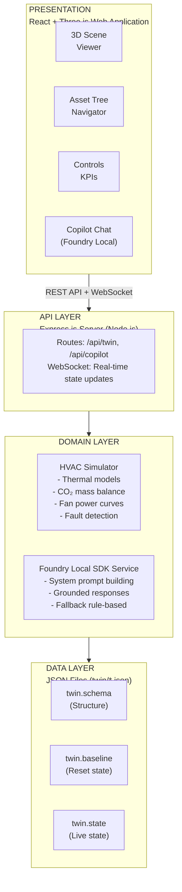
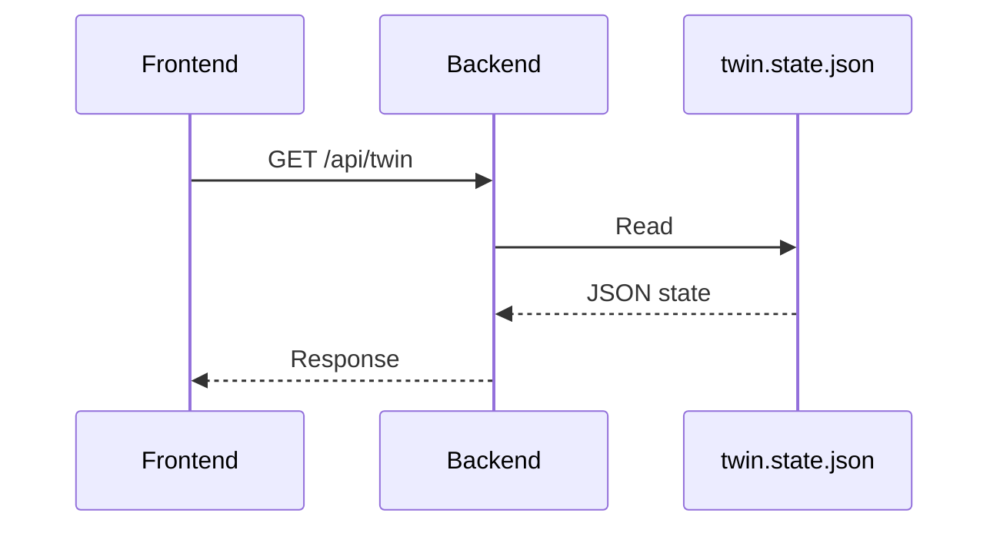
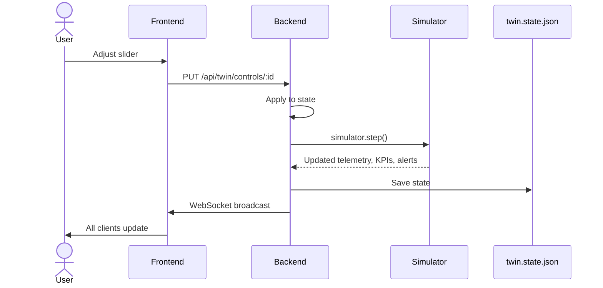
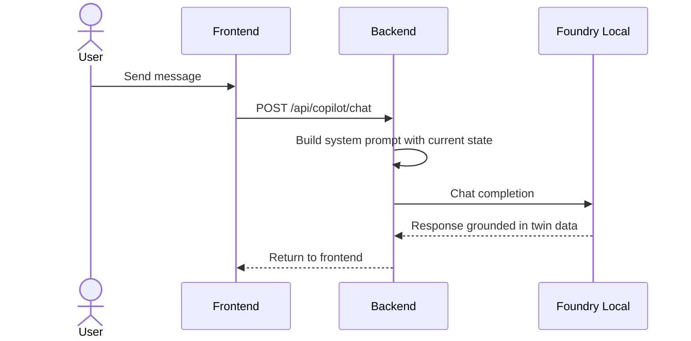

# Architecture Documentation

## System Overview

The HVAC Digital Twin follows a layered architecture with clear separation of concerns:



## Data Flow

### 1. State Loading


### 2. Control Change


### 3. Copilot Query


## Component Details

### Twin State (JSON)

The twin state follows a structure inspired by Azure Digital Twins and RealEstateCore:

```json
{
  "metadata": { "id", "name", "version", "simulationTime" },
  "assets": [{ "id", "type", "name", "parentId", "properties", "meshId" }],
  "relationships": [{ "sourceId", "targetId", "relType" }],
  "telemetry": [{ "id", "assetId", "pointType", "value", "unit", "history" }],
  "controls": [{ "id", "assetId", "controlType", "value", "min", "max" }],
  "kpis": [{ "id", "name", "value", "formula", "inputs", "status" }],
  "alerts": [{ "id", "severity", "assetId", "message", "ruleId" }],
  "faultRules": [{ "id", "condition", "severity", "recommendedAction" }],
  "simulatorState": { "outdoorTemp", "solarLoad", "timeOfDay" }
}
```

### Simulator Engine

The HVAC simulator implements deterministic physics models:

**Zone Thermal Model:**
- 1R1C lumped parameter model
- Heat gains: occupancy, equipment, solar
- Heat removal: supply air cooling
- Temperature change: dT = Q_net × dt / C_thermal

**CO₂ Model:**
- Generation: 0.0084 CFM CO₂/person (ASHRAE)
- Removal: ventilation × (zone_CO₂ - outdoor_CO₂)
- Volume-based accumulation

**Fan Power:**
- Affinity laws: P ∝ (speed)³
- Filter loading factor increases power requirement

**Chiller:**
- Part-load efficiency curve
- COP varies with load and condenser temp

### Fault Detection

Rules evaluate against current state:
```javascript
if (zone.co2 > 800) → warning alert
if (filter.loading > 0.7) → warning alert
if (abs(zone.temp - setpoint) > 3) → warning alert
```

Each alert includes:
- Severity level
- Root cause explanation
- Recommended action
- Reference to triggering rule

### Copilot Grounding

The system prompt includes:
1. Role definition as HVAC Operations Copilot
2. Current KPI values and statuses
3. Active alerts with details
4. Zone conditions (temp, CO₂, occupancy)
5. Available controls and ranges
6. Instructions to only cite provided data

If Foundry Local is unavailable, falls back to keyword-based responses using actual state values.

## Security Considerations

- No authentication in demo (add for production)
- JSON state files should be protected
- Foundry Local runs locally (no cloud dependency)
- WebSocket has no auth (add token validation for production)

## Scaling Considerations

For production deployment:
- Replace JSON files with database (PostgreSQL, MongoDB)
- Add Redis for real-time state caching
- Use message queue for simulation events
- Deploy behind load balancer
- Add proper logging and monitoring
