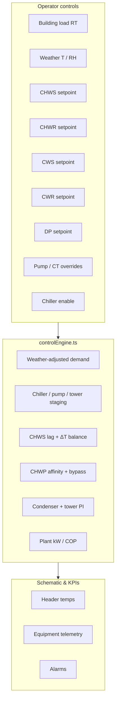

# L29 Chiller Plant — Controls, Formulas & Parameter Relationships

**Plant:** mTower Level 29 chiller plant room (virtual simulator)  
**Schematic:** [`ChillerPlant2DView.tsx`](../frontend/src/components/chiller/ChillerPlant2DView.tsx) + [`plantTopology.ts`](../frontend/src/components/chiller/plantTopology.ts)  
**Physics engine:** [`controlEngine.ts`](../frontend/src/services/controlEngine.ts)  
**Constants & laws:** [`plantPhysics.ts`](../frontend/src/services/plantPhysics.ts)  
**Staging:** [`stagingController.ts`](../frontend/src/services/stagingController.ts)  
**UI controls:** right sidebar → **Controls** tab (`ChillerPlantControlPanel.jsx`)  
**Validation:** [`physics-formulas-reference.md`](physics-formulas-reference.md) — core water-side formulas validated on December 2025 M&V data (7/7 checks pass)

---

## 1. Overview

The chiller plant twin is a **2-second-tick thermo-hydraulic model** of a water-cooled plant:

- **Chilled loop:** 3 × 500 RT chillers, 4 CHWP, CHWS/CHWR headers, M/H Rise export branches, bypass valves, expansion tanks (display).
- **Condenser loop:** 3 cooling towers, 4 CWP, CWS/CWR headers, make-up water.
- **Controls:** operator sliders/toggles in the right panel feed `runControlStep()` each tick.

### Domino-effect order (each calculation)

1. Operator inputs  
2. Weather-adjusted building load → chiller count  
3. Chiller load %, kW, COP modifiers  
4. CHWS lag, CHWR from ΔT blend  
5. Required CHW flow → CHWP staging & speed  
6. DP proxy → bypass valve  
7. Condenser / cooling-tower control  
8. CWP staging  
9. Make-up tank  
10. Plant power & KPIs  
11. Alarms  

---

## 2. Controllable parameters

| Control ID | Panel label | Range | Unit | Group | Schematic tie-in |
|------------|-------------|-------|------|-------|------------------|
| `ctrl-building-load` | Building Cooling Load | 200 – 1500 | RT | Building load | M + H Rise load display |
| `ctrl-ambient-temp` | Outdoor Temperature | 22 – 40 | °C | Weather | — |
| `ctrl-humidity` | Outdoor Humidity | 40 – 95 | %RH | Weather | — |
| `ctrl-chws-sp` | Chilled Water Supply Temp | 5 – 10 | °C | Chilled water | CHWS header |
| `ctrl-chwr-sp` | Chilled Water Return Temp | 9 – 16 | °C | Chilled water | CHWR header |
| `ctrl-cws-sp` | Condenser Water Supply Temp | 25 – 35 | °C | Condenser water | CWS header / towers |
| `ctrl-cwr-sp` | Condenser Water Return Temp | 28 – 38 | °C | Condenser water | CWR header |
| `ctrl-dp-sp` | Differential Pressure Setpoint | 10 – 30 | psi | Pumping & DP | CHWP speed, bypass |
| `ctrl-ct-fan` | Cooling Tower Fan Override | 0 – 100 (0=auto) | % | Manual overrides | CT-41-1/2/3 fans |
| `ctrl-pump-spd` | Pump Speed Override | 0 – 100 (0=auto) | % | Manual overrides | CHWP-29-1…4 |
| `ctrl-ch-enable` | Chiller Enable | Off / On | — | Plant enable | CH-29-1/2/3 |
| `ctrl-opt-mode` | Optimization Mode | Off / On | — | Plant enable | *Not wired yet* |

**Automatic (schematic only, not slider-controlled):**

| Element | Behaviour |
|---------|-----------|
| Bypass valves bv-1/2 | Open when measured DP > DP setpoint + 3 psi |
| CWP speed / staging | Follows chiller load % and running chiller count |
| Make-up pumps CWMUP-1/2 | Lead pump on low tank level |
| Expansion tanks ET-01/02 | Static level display |
| M / H Rise | 55% / 45% visual split of total RT |

**Fault scenarios (test buttons):** chiller trip CH-29-3, pump trip CHWP-29-2.

---

## 2.1 On-prem KPIs (KPI tab)

Right sidebar → **KPIs** (`ChillerKPIPanel.jsx`). Targets align with AHRI/ASHRAE water-cooled plant benchmarks (validated plant ≈ **0.605 kW/RT**).

| KPI | Target | Warning |
|-----|--------|---------|
| Plant kW/RT | ≤ 0.65 | > 0.85 |
| Plant COP | ≥ 5.5 | < 4.5 |
| CHW ΔT | 5–7 °C | < 4.5 °C |
| Tower approach | 3–5 °C | > 5 °C |
| Header DP | = setpoint | \|error\| > 5 psi |
| Bypass valve | ≤ 10 % | > 15 % |

Also shown: component kW split (chiller / CHWP / CWP / CT), condenser ΔT, staging counts, estimated wet-bulb.

---

## 3. Core physics formulas (validated / textbook)

### 3.1 Sensible cooling duty (water side)

\[
Q\;[\mathrm{kW}] = \dot{V}\;[\mathrm{m^3/h}] \times \Delta T\;[^\circ\mathrm{C}] \times 1.163
\]

where \(1.163 = \rho\, c_p / 3600\) with \(\rho = 1000\;\mathrm{kg/m^3}\), \(c_p = 4.1868\;\mathrm{kJ/(kg{\cdot}K)}\).

Equivalent: \(Q = \dot{m}\, c_p\, \Delta T\).

- **Code:** `coolingKwFromFlow()` — `plantPhysics.ts`
- **Source:** ASHRAE *Fundamentals* Ch. 1; water properties Ch. 33 / NIST
- **Validated:** metered `rt` reproduced to ≤0.2% error on plant M&V data

### 3.2 Refrigeration ton conversion

\[
Q\;[\mathrm{kW}] = Q_\mathrm{RT} \times 3.517
\]

- **Source:** AHRI 550/590; ASHRAE standard ton (12,000 BTU/h)

### 3.3 Chilled-water temperature difference

\[
\Delta T = T_{CHWR} - T_{CHWS}
\]

- **Source:** ASHRAE hydronic steady-state balance (*Systems & Equipment* Ch. 13)

### 3.4 Required chilled-water flow (staging)

\[
\dot{V}_\mathrm{required} = \frac{Q_\mathrm{demand}}{ \Delta T_\mathrm{design} \times 1.163 },
\qquad \Delta T_\mathrm{design} = 3.4^\circ\mathrm{C}
\]

- **Code:** `controlEngine.ts` — used for CHWP staging only

### 3.5 Plant power balance

\[
P_\mathrm{plant} = \sum P_\mathrm{chiller} + \sum P_\mathrm{CHWP} + \sum P_\mathrm{CWP} + \sum P_\mathrm{CT}
\]

- **Validated:** sub-meter sum matches total `kw` on M&V data

### 3.6 Coefficient of performance & efficiency

\[
\mathrm{COP}_\mathrm{plant} = \frac{Q_\mathrm{cooling}}{P_\mathrm{electrical}},
\qquad
\mathrm{kW/RT} = \frac{P_\mathrm{plant}}{Q_\mathrm{RT}}
\]

- **Source:** ASHRAE *Fundamentals* Ch. 2; AHRI 550/590

### 3.7 Pump / fan affinity laws

\[
\frac{Q_2}{Q_1} = \frac{N_2}{N_1},
\qquad
\frac{P_2}{P_1} = \left(\frac{N_2}{N_1}\right)^3
\]

- **Code:** `pumpPowerFromSpeed()`, `pumpFlowFromSpeed()`
- **Source:** Hydraulic Institute ANSI/HI; ASHRAE *Fundamentals* Ch. 21–22

### 3.8 Cooling-tower wet-bulb approach

\[
T_{CWS,leaving} \geq T_\mathrm{wetbulb} + T_\mathrm{approach}
\quad (\text{typical approach } 3\text{–}5^\circ\mathrm{C})
\]

- **Principle:** condenser model uses weather offset + fan control
- **Validated:** mean approach 3.72 °C on plant data; 100% rows respect wet-bulb limit

### 3.9 First-order thermal lag

\[
x_{k+1} = x_k + (x^* - x_k)\left(1 - e^{-\Delta t / \tau}\right)
\]

- **Code:** `lag()` — CHWS (τ≈25 s), CWS (τ≈30 s), CWR (τ≈40 s)
- **Source:** first-order control model; ASHRAE *Fundamentals* Ch. 7

---

## 4. Engine control equations (simulator heuristics)

These are **correct in direction** for a demonstrator twin; coefficients are tuned, not independently validated.

| Model | Expression | Purpose |
|-------|------------|---------|
| Weather-adjusted load | \(L_\mathrm{demand} = L_\mathrm{base} \times f_\mathrm{temp}(T) \times f_\mathrm{RH}(RH)\) | Demand shaping |
| Temp factor | \(f_\mathrm{temp} = 1 + 0.03(T-32)\) above 32 °C ref | Sensible load |
| RH factor | \(f_\mathrm{RH} = 1 + 0.0015(RH-65)\) above 65% ref | Latent load |
| CHWS modifiers | \(\Delta = 7 - T_{CHWS,SP}\); \(f_\mathrm{load}=1+0.08\Delta\), \(f_\mathrm{kW}=1+0.10\Delta\), \(f_\mathrm{COP}=1-0.05\Delta\) | Setpoint impact |
| Chiller kW | \(P_\mathrm{ch} = P_\mathrm{ref} \times (\mathrm{load\%}/70) \times f_\mathrm{kW}\) | Compressor power |
| CHWS actual | Lag toward SP; +0.3 °C if load > 90% | Supply tracking |
| ΔT blend | \(\Delta T = 0.35\,\Delta T_\mathrm{physics} + 0.65\,(T_{CHWR,SP}-T_{CHWS})\) | Return temp |
| Bypass effect | \(\Delta T_\mathrm{eff} = \Delta T \times (1 - bypass/200)\) | Low-ΔT bypass |
| CHWP speed | \(N = \mathrm{clamp}(70 + 3(DP_{SP}-15), 30, 100)\%\) | DP control |
| DP proxy | \(DP_\mathrm{meas} = 15 + 0.35(N-70)\) | Simulated header DP |
| Bypass logic | Open if \(DP_\mathrm{meas} > DP_{SP}+3\) | Valve staging |
| CWP speed | \(\mathrm{clamp}(55 + 0.35\times\mathrm{load\%}, 30, 100)\%\) | Follows chillers |
| CWS target | \(T_{CWS}^* = SP - 0.04(N_\mathrm{fan}-70) + \Delta T_\mathrm{weather}\) | Tower control |
| CT fan PI | \(N_\mathrm{fan} \mathrel{+}= 8(T_{CWS,act}-T_{CWS,SP})\) | Auto fan |
| CWR target | \(\max(T_{CWR,SP},\, T_{CWS}+2)\) | Condenser range |
| Condenser COP bonus | Up to +12.7% when CWS colder than reference | COP modifier |

### Staging tables

**Chillers** (`stageChillers`):

| Load (RT) | Running |
|-----------|---------|
| 0 or disabled | 0 |
| < 400 | 1 |
| 400 – 900 | 2 |
| > 900 | 3 |

**CHWP** (`stageChwp`):

| Flow (m³/h) | Pumps |
|-------------|-------|
| < 800 | 1 |
| 800 – 1500 | 2 |
| 1500 – 2500 | 3 |
| > 2500 | 4 |

**CWP / towers:** count follows running chillers (max 4 CWP, 3 CT).

---

## 5. Parameter relationships — “if you change X, what happens?”

### 5.1 Building Cooling Load ↑

| Affected output | Direction | Mechanism |
|-----------------|-----------|-----------|
| `buildingLoadRt` | ↑ | Base demand (before weather) |
| Running chillers | ↑ (may step) | Staging table §4 |
| CHW flow required | ↑ | \(Q/(1.163 \times \Delta T_{design})\) |
| CHWP count / speed | ↑ | More flow → more pumps / higher speed |
| Chiller load %, kW | ↑ | Same RT spread over running machines |
| Plant kW, kW/RT | ↑ | More compression + pumping |
| Plant COP | ↓ slightly | Higher part-load or more auxiliaries |
| M/H Rise display RT | ↑ | 55% / 45% of total |
| Alarms (high load, low ΔT) | More likely | Threshold checks |

### 5.2 Outdoor Temperature ↑

| Affected output | Direction | Mechanism |
|-----------------|-----------|-----------|
| Effective load | ↑ | \(f_\mathrm{temp}\) multiplier |
| CWS target offset | ↑ | `weatherCondenserOffset()` |
| CT fan demand | ↑ | Hotter ambient → harder rejection |
| Chiller COP | ↓ | Warmer condenser water |
| Plant kW/RT | ↑ | Combined load + poorer COP |

### 5.3 Outdoor Humidity ↑

| Affected output | Direction | Mechanism |
|-----------------|-----------|-----------|
| Effective load | ↑ | \(f_\mathrm{RH}\) latent component |
| CWS offset | ↑ | Humidity term above 70% RH |
| Tower approach difficulty | ↑ | Higher wet-bulb conditions |

### 5.4 CHWS Setpoint ↓ (colder supply)

| Affected output | Direction | Mechanism |
|-----------------|-----------|-----------|
| `chws` header | ↓ (lags) | First-order lag toward SP |
| Chiller kW | ↑ | \(f_\mathrm{kW}\) modifier |
| Chiller COP | ↓ | \(f_\mathrm{COP}\) modifier |
| Effective load factor | ↑ | \(f_\mathrm{load}\) modifier |
| Compressor lift | ↑ | Larger \(T_{CHWR}-T_{CHWS}\) gradient to maintain |
| Low-CHWS alarms | More likely | If plant cannot meet SP |

### 5.5 CHWR Setpoint ↑

| Affected output | Direction | Mechanism |
|-----------------|-----------|-----------|
| `chwr` header | ↑ | 65% weight on \((T_{CHWR,SP}-T_{CHWS})\) |
| Loop ΔT | ↑ | Blended ΔT increases |
| Low-ΔT alarms | ↓ | Wider design ΔT |

### 5.6 CWS Setpoint ↓ (colder condenser supply)

| Affected output | Direction | Mechanism |
|-----------------|-----------|-----------|
| `cws` header | ↓ (lags) | Target + fan tracking |
| CT fan speed | ↑ (auto) | PI reduces CWS error |
| Chiller COP | ↑ | `condenserCopBonus()` |
| CT fan kW | ↑ | \(P \propto N^3\) |
| High-CWS alarms | Less likely | Better tower performance |

### 5.7 CWR Setpoint ↑

| Affected output | Direction | Mechanism |
|-----------------|-----------|-----------|
| `cwr` header | ↑ (floor) | \(\max(SP, T_{CWS}+2)\) |
| Condenser ΔT range | ↑ | Wider tower range |

### 5.8 Differential Pressure Setpoint ↑

| Affected output | Direction | Mechanism |
|-----------------|-----------|-----------|
| CHWP speed | ↑ | +3% per psi above 15 |
| CHWP kW | ↑ | Affinity \(P \propto N^3\) |
| Measured DP proxy | ↑ | Correlated to speed |
| Bypass valve | ↓ (may close) | Less DP excess |
| Effective ΔT | ↑ | Less bypass mixing |

### 5.9 Pump Speed Override > 0

| Affected output | Direction | Mechanism |
|-----------------|-----------|-----------|
| CHWP speed | Fixed to override | Replaces DP control |
| Flow per pump | ∝ speed | Affinity |
| Pump kW | ∝ speed³ | Affinity |
| Bypass | May open | Higher DP proxy |

### 5.10 CT Fan Override > 0

| Affected output | Direction | Mechanism |
|-----------------|-----------|-----------|
| Fan speed | Fixed to override | Replaces PI control |
| CWS actual | ↓ (over time) | More rejection |
| CT kW | ∝ speed³ | Affinity |
| Chiller COP | ↑ | Colder condenser |

### 5.11 Chiller Enable → Off

| Affected output | Direction | Mechanism |
|-----------------|-----------|-----------|
| All chillers | Stopped | `stageChillers` returns 0 |
| CHWS | Rises | No active cooling |
| CWP / CT staging | 0 | Follows chiller count |
| Plant COP | N/A | No cooling duty |

---

## 6. Schematic tag map (L29 P&ID)

| Schematic | Tags | Primary formulas |
|-----------|------|------------------|
| Chiller trains | CH-29-1/2/3, CHWP-29-1…4, CWP-29-1…4 | Staging, affinity, \(Q=\dot{V}\cdot1.163\cdot\Delta T\) |
| Cooling towers | CT-41-1/2/3 | Fan PI, wet-bulb approach, \(P\propto N^3\) |
| CHW headers | CHWS, CHWR (+70 offset line) | Lag, ΔT blend, energy balance |
| M / H Rise | M (55%), H (45%) | Display split of `buildingLoadRt` |
| Bypass | bv-1, bv-2 | DP-driven position |
| Expansion tanks | ET-01, ET-02 | Display only |
| Make-up | CWMUP-1/2, CWMUTnk | Level-based lead pump |
| Condenser headers | CWS, CWR | Tower + weather model |

---

## 7. References

- ASHRAE *Handbook—Fundamentals* (2021) — Ch. 1, 2, 4, 7, 21, 22, 33  
- ASHRAE *HVAC Systems & Equipment* — Ch. 13 (hydronics), Ch. 40 (towers), Ch. 43 (chillers)  
- AHRI Standard 550/590 — chiller rating & ton definition  
- Hydraulic Institute — pump affinity laws  
- [`physics-formulas-reference.md`](physics-formulas-reference.md) — validation harness & M&V results  
- [`virtual-plant-simulator.md`](virtual-plant-simulator.md) — architecture overview  

---

## 8. Related files

| File | Role |
|------|------|
| `frontend/src/components/chiller/ChillerPlantControlPanel.jsx` | Right-sidebar UI |
| `frontend/src/components/chiller/chillerControlMeta.js` | Per-control formula hints |
| `frontend/src/services/controlEngine.ts` | Simulation step |
| `frontend/src/services/plantPhysics.ts` | Physical constants & laws |
| `frontend/src/services/stagingController.ts` | Equipment staging |
| `frontend/src/services/plantCascade.ts` | Domino-effect trace text |
| `tests/validation/physics/validate_physics.py` | M&V formula validation |
