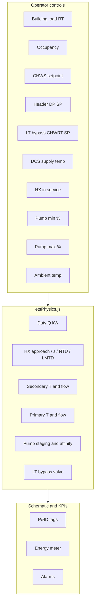

# ETS A-B03-01 — Controls, Formulas & Parameter Relationships

**Station:** Marina Bay Sands Energy Transfer Station `A-B03-01` (serves ASM)  
**Physics core:** [`frontend/src/services/etsPhysics.js`](../frontend/src/services/etsPhysics.js)  
**Simulation engine:** [`frontend/src/services/etsHeatExchangeEngine.ts`](../frontend/src/services/etsHeatExchangeEngine.ts)  
**UI controls:** right sidebar → **Controls** tab (`EtsControlPanel.jsx`)  
**Validation:** [`tests/validation/ets/ets-physics.test.mjs`](../tests/validation/ets/ets-physics.test.mjs)  
**Broader formula catalog:** [`physics-formulas-reference.md`](physics-formulas-reference.md) §2.7

---

## 1. Overview

The ETS twin is a **steady-state thermo-hydraulic model** of a plate heat-exchanger substation:

- **Primary loop (DCS/DCR):** district chilled water from the central plant.  
- **Secondary loop (CHWS/CHWR):** building chilled water to ASM.  
- **Interface:** two plate HX units (`HX-A-B03-01` 600 RT, `HX-A-B03-02` 500 RT).  
- **Pumping:** three secondary CHWP with FLOW-VSD staging.  
- **Controls:** operator sliders in the right panel feed `solveEtsThermoHydraulics()` each 2 s tick.

---

## 2. Controllable parameters

| Control ID | Panel label | Range | Unit | Group |
|------------|-------------|-------|------|-------|
| `ets-load` | Building Cooling Load | 100 – 1100 | RT | Building load |
| `ets-occupied` | Time Program | Occupied / Unoccupied | — | Building load |
| `ets-chws-sp` | CHWS Setpoint | 6 – 10 | °C | Secondary setpoints |
| `ets-dp-sp` | Header DP Setpoint | 60 – 160 | kPa | Secondary setpoints |
| `ets-chwrt-sp` | LT Bypass CHWRT SP | 12 – 17 | °C | Bypass valves |
| `ets-dcs-temp` | DCS Supply Temp | 4.5 – 8 | °C | Primary & HX |
| `ets-hx-service` | Heat Exchangers In Service | 1 – 2 | — | Primary & HX |
| `ets-pump-min` | Pump Speed Min | 20 – 50 | % | Pump staging |
| `ets-pump-max` | Pump Speed Max | 70 – 100 | % | Pump staging |
| `ets-ambient` | Outdoor Temperature | 24 – 40 | °C | Weather |
| `ets-humidity` | Outdoor Humidity | 40 – 95 | %RH | Weather (display only) |

---

## 3. Core physics formulas

These are the **expert-standard** relations implemented in code and verified by unit tests.

### 3.1 Sensible heat / duty

\[
Q\;[\text{kW}] = \dot{V}\;[\text{m}^3/\text{h}] \cdot \Delta T\;[\text{K}] \cdot 1.163
\]

where \(1.163 = \rho\, c_p / 3600\) with \(\rho = 1000\;\text{kg/m}^3\), \(c_p = 4.1868\;\text{kJ/(kg·K)}\).

Equivalent mass-flow form: \(Q = \dot{m}\, c_p\, \Delta T\).

**Source:** ASHRAE *Fundamentals* Ch.1 (sensible heat transfer).

### 3.2 Refrigeration ton conversion

\[
Q\;[\text{kW}] = Q_\text{RT} \times 3.517
\]

**Source:** AHRI / ASHRAE standard ton (3.51685 kW; code uses 3.517).

### 3.3 Steady-state HX energy balance

\[
Q = \dot{m}_\text{pri}\, c_p\,(T_\text{DCR} - T_\text{DCS})
  = \dot{m}_\text{sec}\, c_p\,(T_\text{CHWR} - T_\text{CHWS})
\]

**Source:** ASHRAE *Fundamentals* Ch.1; hydronic steady-state balance.

### 3.4 Heat-capacity rate (for ε–NTU)

\[
C = \dot{m}\, c_p\;[\text{kW/K}], \qquad C_r = C_\min / C_\max
\]

### 3.5 LMTD — counter-flow plate HX

\[
\Delta T_\text{lm} = \frac{\Delta T_1 - \Delta T_2}{\ln(\Delta T_1 / \Delta T_2)},
\qquad Q = U A\, \Delta T_\text{lm}
\]

Terminal differences: \(\Delta T_1 = T_\text{CHWR} - T_\text{DCR}\), \(\Delta T_2 = T_\text{CHWS} - T_\text{DCS}\).

**Source:** ASHRAE *Fundamentals* Ch.4; ASHRAE *Systems & Equipment* Ch.13.

### 3.6 Effectiveness–NTU (counter-flow)

\[
\varepsilon = \frac{Q}{Q_\max}, \qquad Q_\max = C_\min\,(T_\text{hot,in} - T_\text{cold,in})
\]

\[
\varepsilon = \frac{1 - e^{-\text{NTU}(1-C_r)}}{1 - C_r\, e^{-\text{NTU}(1-C_r)}},
\qquad \text{NTU} = \frac{UA}{C_\min}
\]

**Source:** Kays & London, *Compact Heat Exchangers*; ASHRAE Ch.4.

### 3.7 HX approach (commissioning metric)

\[
T_\text{approach} = T_\text{CHWS} - T_\text{DCS}
\]

Baseline screenshot: \(7.5 - 6.0 = 1.5\ ^\circ\text{C}\).

**Source:** ASHRAE *Systems & Equipment* Ch.48 (district / ETS interfaces).

### 3.8 Pump affinity laws (CHWP VSD)

\[
\frac{Q_2}{Q_1} = \frac{N_2}{N_1}, \qquad
\frac{H_2}{H_1} = \left(\frac{N_2}{N_1}\right)^2, \qquad
\frac{P_2}{P_1} = \left(\frac{N_2}{N_1}\right)^3
\]

Staging: pumps online \(= \lceil \dot{V}_\text{sec} / (\dot{V}_\text{ref} \cdot N_\max/100) \rceil\), max 3.

**Source:** Hydraulic Institute; ASHRAE *Fundamentals* Ch.22.

### 3.9 Energy meter integration

\[
E_{k+1} = E_k + \frac{Q_k \cdot \Delta t}{3600}, \qquad \Delta t = 2\ \text{s per tick}
\]

---

## 4. Engine-level correlations (calibrated heuristics)

These tie the model to the MBS SCADA baseline; they are **not** standalone ASHRAE design equations:

| Model | Expression (simplified) | Purpose |
|-------|-------------------------|---------|
| Effective load | \(L_\text{eff} = L_\text{base} \cdot f_\text{weather} \cdot f_\text{occ}\) | Weather & occupancy |
| Weather factor | \(f_\text{weather} = 1 + 0.012\,(T_\text{amb} - 32)\) | Ambient load shaping |
| Occupancy | \(f_\text{occ} = 1.0\) or \(0.55\) | Time program |
| Load lag | \(L_k = L_{k-1} + 0.18\,(L_\text{target} - L_{k-1})\) | Smooth transients |
| Approach vs load | \(T_\text{approach} \propto \text{load fraction}\) (cal. @ 1.5 °C / 466 RT) | HX performance |
| Hot-end pinch | \(T_\text{DCR} = T_\text{CHWR} - \text{pinch}\) | Primary return bound |
| Secondary ΔT | Scales with load around design 7.6 K | CHWR from CHWS |
| LT bypass % | \(f(T_\text{CHWR} - SP_\text{CHWRT},\ \text{load})\) | Bypass valve |
| Header DP | \(DP \approx DP_\text{SP} + 2 \times \text{load fraction}\) | Header DP display |

---

## 5. Parameter relationships — “if you change X, what happens?”

### 5.1 Building Cooling Load (`ets-load`) ↑

| Affected output | Direction | Mechanism |
|-----------------|-----------|-----------|
| `coolingKw`, `coolingDemandRt` | ↑ | \(Q = RT \times 3.517\) |
| `secFlowM3h`, `priFlowM3h` | ↑ | Flow from duty / ΔT |
| `pumpsRunning` | ↑ (may step) | More flow → more pumps |
| `pumpSpeedPct`, `pumpPowerKw` | ↑ | Affinity \(P \propto N^3\) |
| `approachC` | ↑ | Higher load fraction widens approach |
| `effectiveness` | ↓ slightly | Higher load reduces margin |
| `headerDpKpa` | ↑ | DP correlation with load |
| `ltBypassFlowM3h` | ↑ | Higher secondary flow |
| Energy meter `kW`, `kWh` | ↑ | Duty integration |
| Alarms (approach, capacity) | More likely | Threshold checks |

### 5.2 Time Program → Unoccupied (`ets-occupied`)

| Affected output | Direction | Mechanism |
|-----------------|-----------|-----------|
| Effective load | ↓ ~45% | ×0.55 factor |
| All load-driven outputs | ↓ | Same chain as §5.1 |

### 5.3 CHWS Setpoint (`ets-chws-sp`) ↑

| Affected output | Direction | Mechanism |
|-----------------|-----------|-----------|
| `chwsC` | ↑ | Tracks setpoint + small approach offset |
| `chwrC` | ↑ | CHWR = CHWS + ΔT_sec |
| `approachC` | ↑ if DCS fixed | \(T_\text{approach} = T_\text{CHWS} - T_\text{DCS}\) |
| Building comfort / ΔT | Changes | Warmer supply |

### 5.4 Header DP Setpoint (`ets-dp-sp`) ↑

| Affected output | Direction | Mechanism |
|-----------------|-----------|-----------|
| `headerDpKpa` | ↑ | Anchored to SP |
| `supplyPressureBar`, `returnPressureBar` | Shift | Derived from DP |

### 5.5 LT Bypass CHWRT SP (`ets-chwrt-sp`) ↑

| Affected output | Direction | Mechanism |
|-----------------|-----------|-----------|
| LT bypass valve `%` | ↓ | Smaller \((T_\text{CHWR} - SP)\) error |
| `ltBypassFlowM3h` | ↓ | Bypass fraction of secondary flow |

### 5.6 DCS Supply Temp (`ets-dcs-temp`) ↑ (warmer primary)

| Affected output | Direction | Mechanism |
|-----------------|-----------|-----------|
| `approachC` | ↑ if CHWS fixed | \(T_\text{CHWS} - T_\text{DCS}\) |
| `priDeltaT` | ↓ | \(T_\text{DCR} - T_\text{DCS}\) bounded by secondary |
| `priFlowM3h` | ↑ | More flow needed for same Q at smaller ΔT |
| `effectiveness`, `NTU` | Changes | ε–NTU recalculated |

### 5.7 Heat Exchangers In Service (`ets-hx-service`) ↓ (1 of 2)

| Affected output | Direction | Mechanism |
|-----------------|-----------|-----------|
| `capacityTons` | ↓ | 600 or 500 RT removed |
| Load fraction | ↑ | Same demand / less capacity |
| `approachC` | ↑ | Correlation vs load fraction |
| HX-02 valve / duty split | Changes | Standby unit |
| Capacity alarm | More likely | demand > installed capacity |

### 5.8 Pump Speed Min (`ets-pump-min`) ↑

| Affected output | Direction | Mechanism |
|-----------------|-----------|-----------|
| `pumpSpeedPct` | ↑ (floor) | Clamped minimum VSD |
| `pumpPowerKw` | ↑ | \(P \propto N^3\) |
| `pumpsRunning` | May ↑ | If min speed cannot meet flow on fewer pumps |

### 5.9 Pump Speed Max (`ets-pump-max`) ↓

| Affected output | Direction | Mechanism |
|-----------------|-----------|-----------|
| `pumpsRunning` | ↑ | Lower per-pump capacity |
| `pumpSpeedPct` | ↑ on each pump | Spread flow across more units |

### 5.10 Outdoor Temperature (`ets-ambient`) ↑

| Affected output | Direction | Mechanism |
|-----------------|-----------|-----------|
| Effective load | ↑ | \(f_\text{weather}\) above 32 °C |
| Downstream thermal/hydraulic | ↑ | Full load chain |

### 5.11 Outdoor Humidity (`ets-humidity`)

| Affected output | Direction | Mechanism |
|-----------------|-----------|-----------|
| Schematic RH tag | Display only | Not in physics core yet |

---

## 6. Derived schematic outputs (not directly controlled)

| Tag / KPI | Formula / source | Shown on |
|-----------|------------------|----------|
| CHWS | `chwsC` from setpoint + HX | P&ID, controls panel |
| CHWR | `chwsC + secDeltaT` | P&ID |
| DCS / DCR | Primary side balance | P&ID right spine |
| SP / ST / RP / RT | Pressure & temperature taps | ASM headers |
| Header DP | `headerDpKpa` | DP tag between headers |
| LT Bypass Flow | `ltBypassFlowM3h` | Flow meter |
| Primary flow | `priFlowM3h` | P&ID, KPI panel |
| Secondary flow | `secFlowM3h` | P&ID, KPI panel |
| CHWR flow meter (primary return) | `priFlowM3h` at CHWR_FLOW tag | Flow meter on CHWR header |
| HX approach | `approachC` | KPI, footer |
| HX effectiveness ε | ε–NTU | KPI |
| CHWP speed / count | Affinity + staging | Pump faceplates |
| LT / min-flow bypass % | Empirical vs load & SP | Valve faceplates |
| CWS meter kW / ton / kWh | Duty + integration | Energy table |

---

## 7. Baseline reference (screenshot anchor)

At **466 RT** demand, **2 HX in service**, **DCS 6.0 °C**, **CHWS SP 7.5 °C**:

| Quantity | Expected | Code function |
|----------|----------|---------------|
| Thermal duty | ~1638 kW | `kwFromTons(466)` |
| CHWS / CHWR | ~7.5 / 15.1 °C | `solveEtsThermoHydraulics` |
| Approach | ~1.5 °C | \(T_\text{CHWS} - T_\text{DCS}\) |
| Primary flow | ~157.5 m³/h | `flowM3hFromDuty` |
| Pumps running | 2 | Staging |
| Pump speed | ~52.7 % | Affinity |

Asserted by `tests/validation/ets/ets-physics.test.mjs`.

---

## 8. References

| Topic | Standard / text |
|-------|-----------------|
| Sensible heat, ΔT–flow–duty | ASHRAE *Fundamentals* Ch.1 |
| LMTD, heat exchangers | ASHRAE *Fundamentals* Ch.4 |
| Hydronic systems | ASHRAE *Systems & Equipment* Ch.13 |
| District / ETS interfaces | ASHRAE *Systems & Equipment* Ch.48 |
| ε–NTU method | Kays & London, *Compact Heat Exchangers* |
| Pump affinity laws | Hydraulic Institute; ASHRAE *Fundamentals* Ch.22 |
| Refrigeration ton | AHRI / ASHRAE (3.517 kW/ton) |

---

## 9. Related files

| File | Role |
|------|------|
| `frontend/src/components/ets/EtsControlPanel.jsx` | Right-sidebar UI |
| `frontend/src/components/ets/etsControlMeta.js` | Per-control formula hints |
| `frontend/src/services/etsPhysics.js` | Physics core |
| `frontend/src/services/etsHeatExchangeEngine.ts` | 2 s tick, state, equipment |
| `docs/physics-formulas-reference.md` | Project-wide formula catalog |
