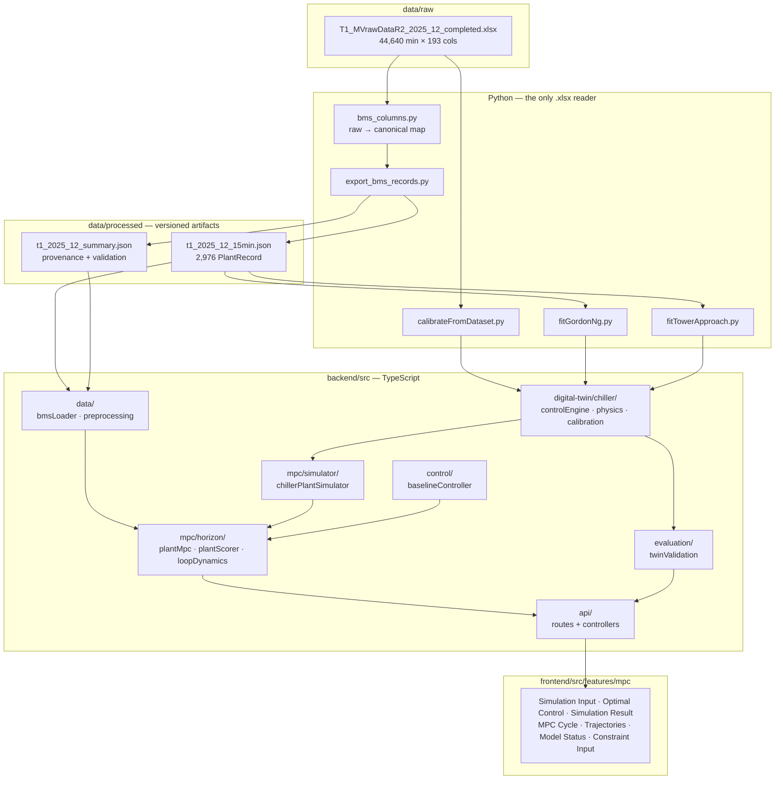
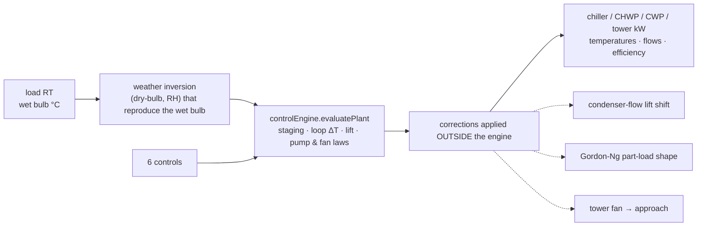
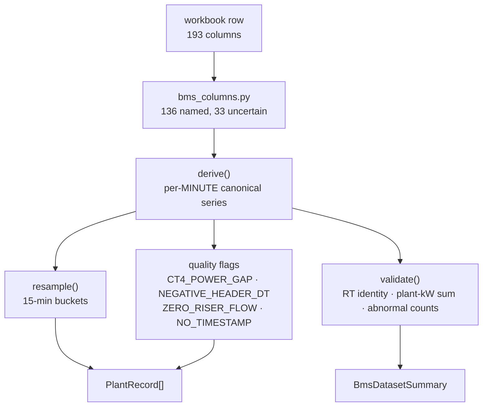
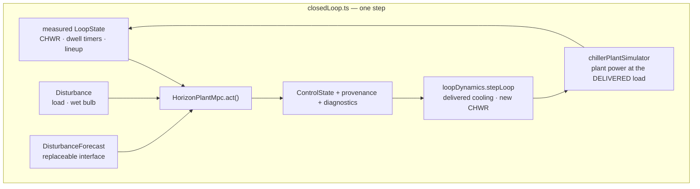
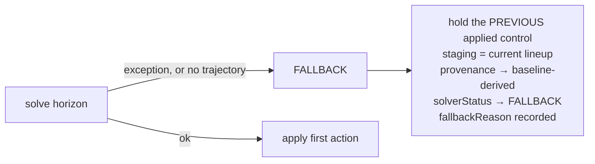
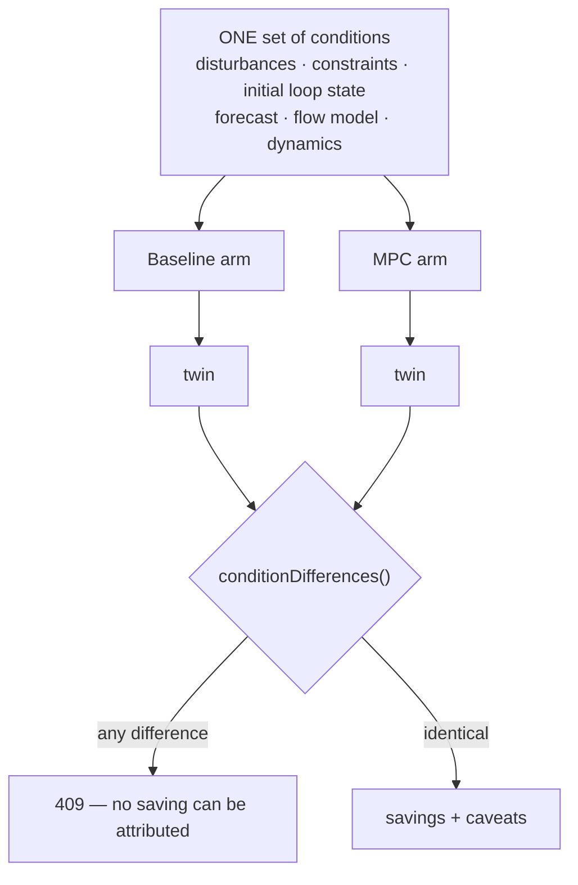
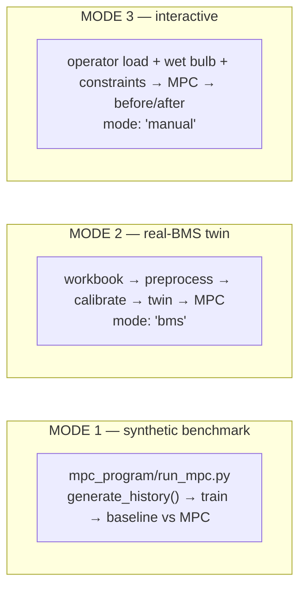
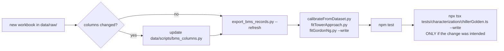

# MPC × Digital Twin — architecture, calibration and how to run it

This document describes how the chiller-plant Model Predictive Controller is
integrated into the T1 Digital Twin: what the twin models, what the MPC decides,
which parts are calibrated against real BMS data and which are physics defaults,
and how to run and re-train the whole thing.

Companion documents:

- [`bms-data-mapping.md`](bms-data-mapping.md) — generated raw-column → canonical-name report
- [`chiller-plant-controls-and-physics.md`](chiller-plant-controls-and-physics.md) — the twin's own equations
- [`physics-formulas-reference.md`](physics-formulas-reference.md) — every formula in the project
- `mpc_program/README.md` — the synthetic benchmark this work descends from

---

## 1. What this is, in one paragraph

A receding-horizon controller decides all six manipulated variables of a
5-chiller / 6-pump / 6-pump / 5-tower plant, every 15 minutes, over a 3-hour
horizon, against a grey-box plant model calibrated to 44,640 minutes of real
December-2025 BMS trend. It is compared against the plant's own recorded
operation under **identical** conditions, and the comparison refuses to produce
a number when those conditions differ. Every control, every model block and
every reported quantity carries a provenance label saying whether it was
measured, derived, inferred, fitted or assumed.

---

## 2. System architecture



Two rules hold across the boundary:

- **Only Python reads Excel.** Node never parses `.xlsx`. The artifacts are a
  small, versioned, explicitly typed contract, so a tag rename upstream is a
  one-file change in `bms_columns.py`.
- **The MPC imports the twin; the twin knows nothing about the MPC.** The
  dependency direction is `api → mpc → digital-twin → physics`, and there is no
  second simulator.

---

## 3. Digital Twin architecture

The twin is one grey-box engine, `digital-twin/chiller/model/controlEngine.ts`,
whose equations are fitted to the December trend. `mpc/simulator/chillerPlantSimulator.ts`
is a **thin typed adapter** over it — not a second physics implementation — plus
four corrections that the engine's static formulation cannot express on its own.



Each correction is **exactly neutral at the calibrated operating point**, so no
site-validated number moves:

| Correction | Why it exists | Neutral at |
|---|---|---|
| `condenserHydraulics.ts` | The engine prices lift off condenser SUPPLY temperature, which does not move with condenser flow in static mode — so slowing the CW pumps was free money. | CWP 70% |
| `chillerPartLoad.ts` | The engine's affine part-load curve has a NEGATIVE intercept, so summed over *n* machines it says more chillers is always cheaper, without limit. | observed load band |
| `towerFanLaw.ts` | The previous fan term moved the approach 0.36 K per 1% of fan, putting the whole observed approach band inside a 10-point fan window. | CT fan 70% |
| `dpHydraulics.ts` | DP setpoint and CHW pump speed are one physical decision; publishing them as two independent optima would publish two numbers no BMS could execute together. | DP 15 psi ⇔ 70% |

### Whole-plant energy

```
Total Plant kW = Chiller kW + CHWP kW + CWP kW + Cooling Tower kW
Plant RT       = cooling actually DELIVERED (not demanded)
Plant kW/RT    = Total Plant kW / Plant RT
Energy kWh     = Σ Total Plant kW × Δt
```

No other auxiliaries are metered at this site, so none are modelled. Standby
draw of stopped machines (≈1.3 kW/chiller) is included, because the DPM meters
show it.

---

## 4. BMS data pipeline



Three decisions in this pipeline are load-bearing:

**Fleet totals are aggregated PER MINUTE, then averaged.** Averaging each
machine over the bucket and then summing the ones whose bucket status came out
ON rewrites history whenever a changeover falls inside a bucket: a machine that
ran 3 minutes of 15 either disappears or is charged for all 15. 65 of 2,976
buckets are affected.

**A sum over no running machines is 0; a mean over none is undefined.** No
machines on really is no power and no flow, and that minute must count as zero
in the quarter-hour average. A *temperature* averaged over nothing is not a
temperature, and is skipped. Getting this backwards moved the condenser
temperature by 7 K on the last three buckets of the month, where CH-5 keeps
running while its thermometer drops out.

**Nothing is imputed.** Flagged buckets are carried through with the flag and
excluded from fits and statistics. `disturbanceProfile` does carry the last
value forward — a closed-loop replay needs a number at every step — but counts
every substitution in `gapSteps` and reports it with the run.

---

## 5. BMS dataset findings

| | |
|---|---|
| Sheet | `T1_MVrawDataR2_2025_12`, 193 columns, **136 mapped**, 33 marked uncertain |
| Rows | 44,640 (1-minute), 2025-12-01 00:00 → 2025-12-31 23:59 |
| Timebase | mode 60 s · **1 duplicate minute** · **1 two-minute gap** · 0 unparseable stamps |
| Buckets | 2,976 at 15 min; 2,879 fittable; 96 flagged (the CT-4 outage day) |
| Equipment | 5 chillers · 6 CHWP · 6 CWP · 5 cooling towers |
| Staging | 3 chillers / 3 CHWP / 3 CWP for **>95%** of the month; towers float 3–5 |

**Header units are unreliable.** `CH-1-ChwFls (degC)` is a flow in L/s;
`CH-1-ChwRt (RT)` is a temperature in °C; `CHW-Riser-L1-3-ChwSt (L/s)` is a
temperature. Every unit in the map is inferred from magnitude and tag stem.

**`Header-hcwf` is CONDENSER water despite the `hcw` prefix.** It runs ~696 L/s
and tracks the sum of the per-chiller *condenser* meters, not the ~376 L/s of
chilled water. Treating it as chilled-water flow overstates cooling by ~85%,
which is why the RT identity uses the four riser meters instead. A test asserts
this.

**Cooling load is DERIVED, not measured.** Only 133 of 44,640 rows carry a
measured RT. The rest are the workbook's own reconstruction:

```
RT = 1.18892327 × Σ(4 riser flows, L/s) × (CHWR − CHWS, K)
```

| Basis | n | MAE (RT) | MAPE | bias | max abs err |
|---|---|---|---|---|---|
| workbook factor, vs the 133 MEASURED rows | 133 | 3.36 | **0.105%** | −0.002 | 12.81 |
| textbook factor 4.186/3.517, same rows | 133 | 4.45 | 0.139% | +3.49 | 16.29 |
| workbook factor, all rows | 44,640 | 0.01 | 0.0003% | −0.00 | 12.81 |

The refit from the measured rows recovers 1.18892327 — which is how we know it
*is* the workbook's constant, and that the workbook applied a small calibration
of its own on top of the physics value.

**Metered plant kW vs the workbook's own `kw` column:** MAE 2.77 kW over 43,198
usable rows (bias −2.77 kW), i.e. the sum of the four blocks reproduces the
workbook total to about 0.15%.

### Known anomalies (carried, not patched)

| Code | Period | What | Action |
|---|---|---|---|
| `CT4_POWER_GAP` | all of 2025-12-31 | `DPM_CT_04_kW` and the CT-4 VSD channels absent for 1,440 rows | excluded from tower fitting and energy baselines |
| `NEGATIVE_HEADER_DT` | 2025-12-23 11:41–11:42 | header CHWS above CHWR, so reconstructed RT is negative | excluded from every fit and from load statistics |

### Signals this site does NOT trend

This list is the reason several controls cannot be site-calibrated, and it is
returned by the API so the UI can say "not available" rather than defaulting.

| Missing | What it blocks |
|---|---|
| `chw_dp_kpa`, `dp_sp_kpa` | No differential pressure of any kind. DP-SP cannot be calibrated or validated here. |
| `chwst_sp_c`, `cwst_sp_c` | No setpoint channels at all — only achieved temperatures, so a setpoint can only be proxied by what the plant held. |
| `chwp_speed_pct`, `cwp_speed_pct` | No pump speed or frequency — VSD **kW** only. Power-vs-speed is an affinity assumption. |
| `ct_fan_speed_pct` | No fan speed — fan VSD **kW** only. The fan→approach law cannot be fitted. |
| `oat_dry_bulb_c`, `oat_rh_pct` | No outdoor dry-bulb or humidity; only the five WST wet-bulb sensors. |
| `chiller_status` and all run flags | ON/OFF must be inferred from metered kW against `RUN_KW`. |
| `valve_position_pct` | No valve positions. |
| `cw_header_flow_ls` | No condenser HEADER flow; per-chiller only (see the `Header-hcwf` note above). |

---

## 6. BMS column mapping

The full generated table lives in [`bms-data-mapping.md`](bms-data-mapping.md).
The shape of the mapping is:

```
Raw Excel column  →  canonical name  →  unit  →  equipment  →  purpose  →  certainty
"Header-hcwst (degC)" → header_chwst_c → degC → CHW header → CHWS achieved → confirmed
"Header-hcwf"         → cw_header_flow_ls → L/s → CW header → heat-rejection checks → confirmed
"CH-1-ChwFls"         → ch1_chw_flow_ls → L/s → CH-1 evap → per-machine flow → confirmed
"CHWP_1_VSDkW"        → chwp1_vsd_kw   → kW  → CHWP-1 → cross-check only → UNCERTAIN
```

The canonical names the rest of the system uses (`shared/types/bms.ts`):

```
t · minutes
loadRt · wetBulbC
chwsC · chwrC · chwDeltaT · chwFlowLs · riserFlowLs
cwsC · cwrC · cwFlowLs · cwHeaderFlowLs
chillerStatus[] · chwpStatus[] · cwpStatus[] · ctStatus[]
chillerKw[] · totalChillerKw · chwpKw · cwpKw · towerKw · totalPlantKw · plantKwPerRt
qualityFlags[]
```

Raw column names appear in `data/scripts/bms_columns.py` **and nowhere else**.

---

## 7. MPC architecture



### The solver

A **beam search / dynamic program over trajectories**. At each of the 12 horizon
steps every surviving trajectory is expanded by every admissible
`(staging, CHWST, DP)` transition; the loop is advanced; the operating point is
priced; nodes agreeing on `(lineup, dwell signature, CHWR, CHWST, DP)` are
merged keeping the cheapest; the best 16 survive.

Beam search rather than a gradient method because the problem is genuinely
mixed-integer and non-smooth: staging is discrete, dwell timers are
combinatorial, the tower approach clamps, and the flow constraints bind. It also
always returns *something* — every constraint is priced as a penalty inside the
search, so a least-violation plan exists even in a corner where nothing is
strictly feasible.

### Which variable is solved where, and why

| Variable | Solved by | Reason |
|---|---|---|
| Chiller staging | beam search | integer, and dwell timers tie each step to the last |
| CHWST setpoint | beam search | changes the loop return temperature, which persists |
| DP setpoint | beam search | changes flow, which changes the return temperature |
| CHWP speed | derived from DP | one physical decision; a DP loop sets the pump speed |
| CWP speed | inner coordinate search | condenser side only, no thermal memory |
| CT fan speed | inner coordinate search | same |

Putting the condenser-side pair into the beam would multiply the branching
factor by ~25 for no modelling benefit: nothing about running the fan at 62%
this step changes what is optimal next step. Both nevertheless have real
*interior* optima, so they are solved properly rather than clamped.

### Receding, not open-loop

The plan spans 12 steps and exactly the **first** action is applied. The next
step re-measures the loop, re-forecasts and re-solves from scratch.
`plannedStaging` / `plannedChwstC` / `plannedDpPsi` in the diagnostics are the
rest of the plan, exposed so the UI can show what the controller *intended* —
they are never executed. A test asserts this.

### Performance

An engine evaluation is ~115 µs and a run asks for tens of thousands, so two
caches carry it: an outer cache on the exact operating point (delivered load
bucketed to 5 RT) and an inner cache for the condenser-side solve on coarse
load/wet-bulb buckets. Both live for the whole run — consecutive horizons
overlap by all but one step. Measured cost: **~0.5 s per step**, so 16 steps
(4 h) ≈ 8 s and 96 steps (a full day) ≈ 35 s.

The 5 RT bucket is an optimisation, not a modelling choice, and a test enforces
that — but enforces the right thing. Against a 0.5 RT reference the *efficiency*
moves by 0.16% and the reported saving by 0.16 percentage points. It does not
always pick the byte-identical plan, and requiring that would be requiring the
wrong thing: the search is discrete, so where two branches are almost exactly
tied (DP 13.5 vs 15 psi for a single step, in the measured case) a fraction of a
kW tips which one wins, and the two plans then run to kWh totals 0.7% apart
while costing the same. That is a property of the tie, not of the cache, which
is why the test holds kW/RT — the measure that divides out the difference in
cooling served.

---

## 8. Forecast models

Load and wet bulb are **disturbances** — the plant must serve them and the
controller cannot move them. Everything sits behind one interface with one
method, `DisturbanceForecast.at(nowIndex, lead)`, so a weather API, a DDMS feed,
an operator profile or a learned model are drop-in replacements.

| Provider | What it is | Honest reading |
|---|---|---|
| `perfect-foresight` | the exact recorded future | **upper bound**, never deployable |
| `degraded-foresight` | recorded future + error growing with lead time (default) | the realistic middle |
| `persistence` | today's value held flat | **lower bound** — no forecast at all |

The degraded error is deterministic in the *target* step, not per call. The
horizon slides over the same future step many times, and a fresh draw each time
would let the controller average the noise away and behave as if it had perfect
foresight by accident. T1 trends no forecast, so none of these is
site-calibrated and each carries its own caveat string, printed verbatim in the
run report.

---

## 9. Control variables — what is genuinely optimised

| # | Control | Status | What backs it |
|---|---|---|---|
| 1 | **CHWST-SP** | REAL-BMS CALIBRATED + OPTIMISED | Chiller lift response fitted month-wide; bounded by the operator's CHWR return limit, which is what makes the trade-off two-sided |
| 2 | **DP-SP** | PHYSICS MODEL + OPTIMISED | Searched, and its effect (flow → ΔT → return temperature → pump kW) is fully modelled. The DP↔speed relation itself is a twin default: this site trends no DP at all |
| 3 | **Chiller staging** | REAL-BMS CALIBRATED + OPTIMISED | Affine level + Gordon-Ng part-load shape, both fitted to this trend; dwell timers enforced |
| 4 | **CHWP speed** | PHYSICS MODEL + DERIVED | Follows the optimised DP setpoint through one documented map so the pair is executable. Power *level* measured; affinity response assumed |
| 5 | **CWP speed** | PHYSICS MODEL + OPTIMISED | Cubic pump power (measured reference) against a condenser-flow lift penalty priced with the engine's own calibrated lift slope |
| 6 | **CT fan speed** | PHYSICS MODEL + OPTIMISED | Cubic fan power (measured reference) against a site-fitted approach level shaped by a standard tower power law |

### The trade-offs, verified by sweep at 3,094 RT / 24.8 °C wet bulb

```
CWP speed   40%  1968 kW      CT fan  30%  1893 kW
            50%  1862             40%  1846
            60%  1814             50%  1819
            70%  1807  ← optimum  60%  1807  ← optimum
            80%  1836             70%  1807
            90%  1897 (flow cap)  80%  1819
           100%  1990             90%  1841
                                 100%  1874
```

Both are interior optima. Slowing the CW pumps saves cubic pump power but costs
compressor lift; speeding the fans buys condenser temperature but costs cubic
fan power. Neither saturates at a bound, which is what makes the decision real.

---

## 10. Models trained or calibrated from real BMS

| Model | Status | Fit quality |
|---|---|---|
| Chiller power (level) | **site-calibrated** | 0.89% blocked-CV MAE, 0.83% in-sample, over 43,026 usable minutes |
| Chiller part-load shape (Gordon-Ng) | **site-calibrated** | held-out MAE **5.21 kW**, MAPE 1.05%, R² 0.919 (28,732 minutes, last 7 days never seen) |
| Cooling-tower approach (level) | **site-calibrated** | held-out MAE **0.103 K**, R² 0.932 (last 7 days, whole-day split) |
| Pump power (CHWP / CWP) | partially calibrated | *level* fitted to measured kW; power-vs-speed is affinity, unexercised by the data |
| CHW loop dynamics | partially calibrated | flow-per-pump and the RT identity measured; **capacitance not identifiable** |

### Gordon-Ng vs the affine curve (requirement: compare, don't assume)

Fitted per-machine from the measured evaporator duty, leaving chilled-water
temperature, entering condenser temperature and metered compressor power.
Chronological split, last 7 days held out, never shuffled.

| | n | MAE | MAPE | R² |
|---|---|---|---|---|
| **Gordon-Ng**, held out | 28,732 | **5.21 kW** | **1.05%** | **0.919** |
| Affine curve, held out | 28,732 | 12.48 kW | 2.55% | 0.795 |

And the extrapolation that decided it, at the median temperatures:

| Per-machine load | Gordon-Ng | Affine |
|---|---|---|
| 10% | 143 kW (1.147 kW/RT) | 37 kW (0.298 kW/RT) |
| 30% | 225 kW (0.599) | 171 kW (0.455) |
| 50% | 320 kW (0.512) | 304 kW (0.486) |
| 80% | 492 kW (0.492) | 504 kW (0.504) |
| 100% | 628 kW (0.502) | 637 kW (0.510) |

Gordon-Ng gives the U-shaped kW/RT curve a real centrifugal has, with its
minimum near 70–80% load and a positive no-load loss. The affine curve's kW/RT
falls monotonically to 0.298 at 10% load, which is not a chiller.

**The resolution used:** the affine curve keeps the *level* (it is the better
in-sample fit and the whole month-wide calibration rests on it) and is
multiplied by the ratio of the two models' *shapes*, normalised at the observed
median load. The factor is exactly 1.0 there, so no calibrated operating point
moves, and it only bites where the affine curve was never entitled to speak: +8%
at 50% load, +35% at 30%.

Why this matters and is not cosmetic: summed over *n* machines carrying a fixed
plant load *L*, the raw affine curve reads `−29.41·n + 0.533·L`, which falls
without limit as machines are added. A staging optimiser given that curve stages
up to the last available chiller at every load and books the difference as a
saving. The corrected model prices minimum staging cheapest at every load, which
is what the plant's own operation shows.

---

## 11. Models still using physics or default assumptions

| Model | Why it cannot be fitted here | Constant |
|---|---|---|
| Cooling-tower fan → approach | Fan VSD **power** is trended; fan **speed** never is | `approach ∝ (ref speed / fan)^0.5` |
| Condenser flow → compressor lift | The plant ran its CW pumps at a fixed point all month, so the *sensitivity* is not identifiable — only the reference point (4.26 K at 696 L/s, measured) | Dittus-Boelter exponent 0.8, bundle approach 1.5 K |
| CHW differential pressure | No DP channel of any kind exists | 70% at 15 psi, +3 %/psi |
| Pump / fan power vs speed | No speed channel | affinity cube about a measured reference kW |
| CHW loop capacitance | The cooling load in this workbook is derived from the loop temperatures themselves, so there is no independent load signal to regress the imbalance against | 650 RT/K/step ≈ 622 m³ of loop water |
| Loop soak on shutdown | The plant never stopped in December | 21 °C target, 7 h time constant |
| Load / wet-bulb forecast | No forecast is trended | recorded history, perfect or lead-degraded |

Every one of these is exported at `GET /api/mpc/model-status` with its missing
inputs named, and every control that depends on one says so in the UI.

---

## 12. Whole-plant objective

All terms are kW-equivalent, so the objective has one unit and the reported
breakdown can be read directly.

```
J = Σ over horizon [ plant kW
                   + unservable cooling  × 50    kW/RT
                   + deferred cooling    × 0.8   kW/RT
                   + CHWR overshoot      × 800   kW/K
                   + chiller switches    × 120   kW each
                   + CHWST movement      × 8     kW/K
                   + DP movement         × 1.5   kW/psi
                   + speed movement      × 0.15  kW/%
                   + constraint violation× 10000 kW
                   ] × Δt
  + loop energy left behind at the horizon end × (what it would cost to remove)
```

Three of these deserve their reasons stated:

**Unservable cooling is priced ~100× the marginal cost of making a ton**, so a
schedule that cannot serve the load loses to any schedule that can. The energy
objective can never sacrifice required cooling.

**Deferred cooling is priced far lower than unservable cooling.** Shifting load
into the loop is exactly the flexibility an MPC is supposed to exploit. It is
not free — the CHWR penalty catches it if it goes too far.

**The terminal storage term is what stops the saving being an accounting
trick.** Without it the controller can end every horizon with a warmer loop than
it started, bank the compressor energy it did not spend, and report deferred load
as a saving. Priced at 1.0 the deferred cooling costs exactly what serving it
would have cost, so shifting load in time is still allowed — it just stops being
free. Set `terminalStorageWeight: 0` to see the unpenalised behaviour.

**The movement penalties are tuning, not physics.** The rate limits already stop
a control from jumping; they do not stop it oscillating *inside* the allowed step
every cycle, which is how an MPC wears out actuators. A small movement cost makes
"stay where you are" win any tie.

---

## 13. Constraints

Plant **limits** live in `ConstraintConfig` (what the plant is allowed to do) and
are all operator-editable in the right sidebar. Search **resolution and
weights** live in `horizonConfig.ts`. Keeping them apart means an operator
widening a setpoint band never has to think about beam width.

| Group | Constraints |
|---|---|
| Chiller | CHWST min/max · per-unit rated capacity · min/max PLR · min/max evaporator flow · min/max condenser flow · availability |
| CHWP | speed min/max · flow min/max · DP min/max · rated power/flow/head |
| CWP | speed min/max · flow min/max · rated power/flow/head |
| Tower | fan speed min/max · **minimum approach** · max CWST · rated heat rejection / water flow |
| System | DP min/max · max CHW & CW header flow · min/max running chillers · required standby · **max CHWR (return limit)** · max plant demand · max chiller starts per run · operating hours · per-cycle move limits for CHWST, DP, CWP and CT fan · **minimum chiller runtime and off-time** |

Notes on the ones that do the most work:

- **Max CHWR** is the single most consequential limit in the panel. Raising
  CHWST and slowing the CHW pumps both save power by letting the loop run
  warmer; this says how much warmer is acceptable. Without it, both look like
  free money, because the twin has no coil or zone model to push back.
- **Minimum runtime / off-time ARE enforced**, by the horizon controller's dwell
  rules: they decide which machines are eligible to switch at each step, so a
  plan that would breach them is never reachable.
- **Per-cycle move limits shape the search**, they are not checked afterwards. A
  limit that only produces a violation report is a complaint, not a constraint.
- **Operating hours** default to 24/7, which is what T1 ran. The mechanism is
  implemented and tested but unexercised by the shipped dataset.
- `maxPlantKw`, `maxChillerStartsPerRun` and the operating-hours window are
  disabled by 0, because inventing a demand cap this site never declared would
  be a constraint the operator did not choose.

---

## 14. Fallback strategy



An MPC that fails must fail to what the plant was already doing — never to a
partial or mid-search result. The fallback also *reconciles* the control it
returns (DP and pump speed made consistent), so it cannot emit a contradiction
either. Fallback steps are counted in the solver summary, the count is rendered
in the UI, and a caveat is raised, because a fallback step is not an optimised
step and the saving above it includes them.

---

## 15. Baseline controller

The saving figure is only as trustworthy as the baseline. Two are shipped and
both are anchored on what T1 measurably did.

| Baseline | What it is | Used for |
|---|---|---|
| `recordedStagingBaseline` | replays the staging the plant **actually ran** that day, inferred from metered compressor kW | BMS-mode runs (default) |
| `fixedStagingBaseline` | the 3-machine lineup held for >95% of December, plus an add-only CHWR guard with hysteresis | manual and synthetic runs |

Both hold every continuous setpoint at the plant's own operating point — which
is also what the site did: T1 ran fixed CHWS, fixed pump speeds and auto towers
all month. So `baseline-derived` on those rows is a statement of fact about the
incumbent, not an admission that the baseline was under-modelled.

The guard is **add-only and hysteretic** on purpose: a baseline that also shed
machines would be doing half of what the MPC is credited for, and one without
hysteresis would chatter and lose energy no real sequencer would lose.

---

## 16. Evaluation method — the fairness guarantee



Both arms are constructed from one `shared` object, so it is not possible to
accidentally give the MPC a different load, starting state or constraint set.
`compareRuns` then **re-checks** it — source, day, step count, step length, a
hash of the disturbance series, a hash of the constraint config, and the initial
loop state — and **throws 409** if anything differs. A comparison run under
different conditions is not a weak result; it is not a result.

### Which percentage is the headline

Decided by the server, not the UI. If the two arms delivered cooling differing
by more than 0.5%, a kWh difference is partly a difference in load served and
the headline switches to kW/RT. The UI must not override this.

### Caveats

Every reason to read the number carefully is returned and rendered in full,
never truncated or hidden: unequal delivery, perfect foresight, steps outside
the twin's calibration envelope, unmet load, a warmer loop, extra starts,
infeasible steps, and exceeding a configured start cap.

---

## 17. Digital Twin validation

`GET /api/mpc/twin-validation` replays every fittable measured bucket through
the twin, driving it with **only** measured cooling load, measured wet bulb and
inferred staging. Everything below is model output.

| Channel | Reference | MAE | MAPE | R² | bias |
|---|---|---|---|---|---|
| Total plant power | measured DPM sum | 22.26 kW | 1.25% | 0.943 | +1.10 |
| Chiller power | measured compressors | 16.80 kW | 1.13% | 0.965 | +10.30 |
| Pump power (CHWP+CWP) | measured DPM | 6.79 kW | 2.93% | −0.204 | −6.30 |
| Cooling-tower power | measured DPM | 8.14 kW | 13.01% | −0.066 | −2.90 |
| Plant efficiency | derived | 0.0073 kW/RT | 1.25% | 0.102 | +0.0006 |
| Header CHWR | measured | 0.090 °C | 0.62% | 0.779 | −0.022 |
| CHW flow | measured risers | 4.57 L/s | 1.18% | 0.063 | +1.55 |
| Condenser water supply | measured | 0.156 °C | 0.55% | 0.575 | +0.005 |
| Condenser water return | measured | 0.169 °C | 0.52% | 0.823 | −0.043 |

*2,879 buckets over 30 days.*

**Read the R² column carefully.** Three channels have near-zero or negative R²
and small errors at the same time. That is not a contradiction: T1 held its
pumps, flow and tower duty almost constant all month, so those series have
almost no variance to explain, and R² against a near-constant target is
uninformative — a model can be within 3% and still "worse than the mean". MAE
and MAPE are the meaningful columns there. The tower block is genuinely the
weakest (13% MAPE), which is the expected consequence of not being able to see
fan speed.

**This is an in-sample replay.** The chiller-power constants were fitted on this
same month. The honest out-of-sample numbers are reported alongside, from each
individual fit: chiller power 0.89% blocked-CV MAE, tower approach 0.103 K on
held-out days, Gordon-Ng 5.21 kW on held-out days. What the replay *does* test,
and nothing else does, is whether the whole assembled chain — weather inversion,
staging, tower approach, condenser correction, part-load shape, pump laws —
reproduces the plant when driven only by load, wet bulb and staging.

### Not scorable, and why

| Channel | Reason |
|---|---|
| Header CHWS | Fed to the twin as the setpoint proxy — comparing an output against its own input is circular |
| CHW differential pressure | No DP channel exists |
| Pump / fan speeds | Not trended — VSD kW only |
| Plant RT | An INPUT to the replay. Its own reconstruction is validated separately at 0.105% MAPE against the 133 measured rows |

---

## 18. Backend API

| Method | Route | Purpose |
|---|---|---|
| GET | `/api/health` | liveness |
| GET | `/api/simulation/config` · `/state` · `/dataset/rows` | the live twin |
| POST | `/api/simulation/evaluate` · `/predict` · `/control` · `/apply` · `/advance` · `/scenario` · `/reset` · `/fault` · `/duty` · `/dataset/replay` | drive the twin |
| GET | `/api/mpc/config` | design constraints + violation labels |
| GET | `/api/mpc/baseline` | live plant as `SimulationInput` + `ControlState` |
| POST | `/api/mpc/optimize` | **steady-state** optimum at ONE operating point |
| POST | `/api/mpc/simulate` | score a single candidate |
| POST | `/api/mpc/restore` | commit a control state to the twin |
| GET | `/api/mpc/horizon/config` | solver defaults, modes, forecasts, recorded days |
| **POST** | **`/api/mpc/horizon/compare`** | **baseline vs MPC over identical conditions** |
| GET | `/api/mpc/model-status` | per-model calibration status + missing signals |
| GET | `/api/mpc/twin-validation` | twin vs measured plant, channel by channel |
| GET | `/api/bms/dataset-summary` · `/bms/days` · `/bms/day/:day` | the measured dataset |
| POST | `/api/copilot/chiller` | intent parsing over the twin |

### Request

```json
{
  "mode": "bms",
  "day": "2025-12-14",
  "steps": 16,
  "forecast": "degraded",
  "simulationInput": { "buildingLoadRt": 1800, "wetBulbC": 27.5 },
  "constraints": {
    "chiller": { "minChwstC": 6.0, "maxChwstC": 8.0 },
    "system":  { "maxChwrC": 15.5 }
  },
  "horizon": { "horizonSteps": 12, "beamWidth": 16 }
}
```

`constraints` is a partial patch merged over the design defaults and then
validated: an invalid set is a **400 with the reason**, and an unknown `horizon`
or `dynamics` key is a 400 too. A tuning knob that looks applied but was not is
worse than an error, because the run still returns a plausible number.

### Response

```json
{
  "status": "COMPLETED",
  "scenario":   { "mode": "...", "provenance": { "...": "MEASURED / DERIVED / ASSUMED / NOT TRENDED" }, "...": "..." },
  "conditions": { "source": "bms", "day": "...", "steps": 16, "stepMinutes": 15 },
  "savings":    { "totalPlantPct": 6.68, "kwPerRtPct": 4.27, "basis": "unequal-delivery", "headline": "kwPerRtPct" },
  "optimisedControls": { "chwstSetpointC": "optimized", "chwpSpeedPct": "derived", "...": "..." },
  "caveats":    ["..."],
  "baselineControl": { "...": "the BEFORE column" },
  "appliedControl":  { "...": "the AFTER column" },
  "baseline": { "trajectory": [], "totals": {} },
  "mpc":      { "trajectory": [], "totals": {} },
  "solver":   { "steps": 16, "fallbacks": 0, "meanSolveMs": 650, "statuses": {}, "firstStepCostKw": {}, "activeConstraints": [] },
  "modelStatus": { "models": [], "missingSignals": {} }
}
```

The frontend never reconstructs an MPC conclusion from low-level fields:
`appliedControl`, `baselineControl`, `savings.headline`, `optimisedControls` and
`caveats` are all assembled server-side.

### Diagnostics, per step

`solverStatus` · `solveMs` · `objectiveKw` · `nodesExpanded` · `nodesKept` ·
`forecastLoadRt[]` · `forecastWetBulbC[]` · `predictedChwrC[]` ·
`predictedPlantKw[]` · `plannedStaging[]` · `plannedChwstC[]` · `plannedDpPsi[]` ·
`costBreakdownKw{}` · `activeConstraints[]` · `violations[]` · `fallbackUsed` ·
`fallbackReason`.

---

## 19. Frontend integration

```
LEFT SIDEBAR                       CENTRE            RIGHT SIDEBAR
Simulation Input                   the Digital       Constraint Input
  conditions source, day,          Twin schematic      chiller / CHWP / CWP /
  run length, forecast,            (moves to the       tower / system
  building load, wet bulb          applied optimum)
Optimal Control                                      Solver Status
  6 rows, before → after,                              fallbacks, objective
  provenance badge + model note                        breakdown, active
Simulation Result                                      constraints, violations
  chiller / pump / tower / total kW,
  plant RT, kW/RT, energy kWh,                       [ Run MPC ]
  saving %, caveats in full
MPC Cycle
  the 6 stages, each with a real number
Trajectories
  forecast · control · plant state
Model & Calibration Status
  per-model basis + fit, missing signals,
  twin-vs-plant validation on demand
```

The disturbances come from the left and the limits from the right, which is
exactly the division the panels present — there is no third, hidden source of
truth for what a run was asked to do.

Three UI rules are load-bearing:

- **Nothing renders a fabricated optimum.** Every control row carries a
  provenance badge (*Optimised* / *Derived* / *Inherited baseline* / *Fixed* /
  *Not available*) and a hover note saying what the model behind it rests on.
- **The headline percentage is the server's choice.**
- **Every caveat is rendered**, not truncated, not behind a disclosure.

In recorded-day mode the two disturbance fields are **disabled**: inventing a
load for a day the plant actually ran would be a fabrication.

---

## 20. The three modes



Mode 1 is the original Python program, preserved and still runnable — it is the
mechanism-validation harness and the source of the Gordon-Ng identification
routine this project imports. Its `generate_history()` is **synthetic** and is
never confused with real BMS history: the two live behind different functions in
different languages, and `buildScenario` dispatches on an explicit mode with no
path from one to the other.

`mode: 'synthetic'` inside the TypeScript stack is a third thing again — a
generated diurnal profile over the *calibrated* twin, labelled GENERATED, used
as a benchmark when no recorded day is wanted.

---

## 21. Data provenance — every output traces to one of these

| Label | Meaning | Example |
|---|---|---|
| **REAL BMS MEASUREMENT** | straight from a meter or sensor | wet bulb, all power, all temperatures, riser flows |
| **CALCULATED FROM BMS** | a documented identity over measurements | plant RT, kW/RT, condenser ΔT |
| **INFERRED FROM BMS** | derived where the channel does not exist | equipment ON/OFF from metered kW |
| **DIGITAL TWIN SIMULATION** | model output at given conditions | every kW in a run result |
| **SYNTHETIC MPC DATA** | generated, no site data involved | `mpc_program` history, `mode: 'synthetic'` profiles |
| **MPC FORECAST** | a prediction of a disturbance | `forecastLoadRt[]`, `predictedChwrC[]` |
| **MPC OPTIMIZED CONTROL** | a searched decision | `appliedControl` where provenance is `optimized` |
| **DEFAULT PHYSICS MODEL** | physically reasonable, not site-fitted | DP↔speed, fan→approach, condenser-flow lift, loop capacitance |

Each run returns a `scenario.provenance` block naming, field by field, which of
these applies. Nothing mixes them silently.

**On savings specifically:** a percentage from this system is a *simulated*
result over a site-calibrated (BMS mode) or partially-calibrated (manual and
synthetic modes) Digital Twin. It is never measured before/after data, and the
UI says so under every result.

---

## 22. How to run

### Prerequisites

```
Node   >= 20          (tested on 21.6)
Python >= 3.11        numpy · scipy · matplotlib · openpyxl
```

### The application

```bash
# backend  — http://localhost:3005
cd backend && npm install && npm start

# frontend — http://localhost:3004
cd frontend && npm install && npm run dev
```

Then open the chiller-plant scenario: enter Building Load and Wet Bulb on the
left, adjust the limits on the right, press **Run MPC**.

Or from the command line:

```bash
curl -X POST http://localhost:3005/api/mpc/horizon/compare \
  -H 'Content-Type: application/json' \
  -d '{"mode":"bms","day":"2025-12-14","steps":16}'
```

### Regenerate the data artifacts

```bash
python data/scripts/export_bms_records.py --refresh     # re-read the workbook
python data/scripts/export_bms_records.py               # from the parsed cache
```

Writes `data/processed/t1_2025_12_15min.json`,
`data/processed/t1_2025_12_summary.json` and
`docs/bms-data-mapping.md`. `--out-dir` writes elsewhere, which is how the
exporter is diffed against the shipped artifacts.

### Re-fit the models

```bash
python calibration/scripts/calibrateFromDataset.py       # engine constants
python calibration/scripts/fitTowerApproach.py           # tower approach fit
python calibration/scripts/fitGordonNg.py --write        # Gordon-Ng part-load
```

Each writes a GENERATED TypeScript artifact under
`backend/src/digital-twin/chiller/calibration/`. Do not hand-edit those files;
re-run the script.

### The synthetic benchmark (Mode 1)

```bash
npm run benchmark:selftest   # internal consistency checks, ~30 s
npm run benchmark            # 28 train + 6 test days, ~1 min
npm run benchmark:quick      # reduced run, ~20 s
```

`--outdir` defaults to a RELATIVE `results`, so these scripts `cd mpc_program`
first — running `python mpc_program/run_mpc.py` from the repo root drops a
`results/` directory at the top level instead.

### Tests

```bash
cd backend && npm test           # 141 tests
cd backend && npm run typecheck  # tsc --noEmit
cd frontend && npm run build     # vite production build
cd frontend && npm run typecheck # tsc --noEmit
npx tsx tests/characterization/chillerGolden.ts   # twin output vs golden
```

---

## 23. How to retrain



Staleness is detected, not assumed: the records artifact carries an
`artifactVersion` and the loader refuses anything that does not match, rather
than half-reading it — a missing field reads as `null`, and `null` is how this
codebase says "not measured", which is exactly the wrong thing to infer from a
version skew. Each fitted artifact records its source file, its train/test day
boundaries and its held-out scores, so a stale fit is visible in the API's
model-status response.

---

## 24. Current limitations

**Modelling**

1. **No coil or zone model.** The consequence of a warmer chilled-water supply
   at the *load* — reduced dehumidification, a zone that drifts — cannot be
   represented. The CHWR return limit is the operator's proxy for it, and it is
   the reason CHWST reset is bounded rather than run to its band edge.
2. **Loop capacitance is assumed.** The workbook's cooling load is derived from
   the loop temperatures themselves, so there is no independent load signal to
   regress the imbalance against. 650 RT/K/step (≈622 m³) is plausible for a
   plant this size and is stated as an assumption everywhere it matters.
3. **Condenser-flow sensitivity is physics, not data.** The reference point is
   measured; the slope is not, because the plant never moved its CW pumps.
4. **The tower fan law is physics, not data.** Fan VSD *power* is trended; fan
   *speed* never is.
5. **DP is entirely a default model.** This site has no differential-pressure
   channel of any kind. The pump operating point and its energy are real; the DP
   number attached to them is not site-validated.
6. **The calibrated envelope is narrow.** T1 ran 2,600–3,470 RT on three
   chillers with CHWS at 7.55–7.60 °C for essentially the whole month. Anything
   outside that box is flagged `extrapolated` on every affected step, and most
   interesting MPC decisions leave it. This is disclosed per run, not averaged
   away.

**Solver**

7. Chiller *selection* is by duty rotation, not optimised per machine. The
   control state already carries `chillerIds`, so a mixed-fleet objective needs
   no interface change — the per-machine Gordon-Ng fits are already computed and
   stored, unused.
8. The condenser-side pair is solved per operating point, not over the horizon.
   Correct in this model (no thermal memory on that side) but it would need
   revisiting if condenser-water storage were ever modelled.
9. A full-day 96-step run takes ~35 s. Interactive runs default to 16 steps.

**Evaluation**

10. The twin validation is an **in-sample replay**. Out-of-sample numbers exist
    per fit and are reported beside it, but there is no held-out *whole-plant*
    score, because there is only one month of data.
11. No tariff, demand-response or time-of-use model. A demand cap exists and is
    enforced; a price signal does not.
12. Savings are simulated, never measured. A real M&V result needs a
    before/after trial on the plant.
