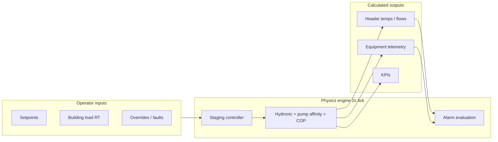

# Virtual Chiller Plant Simulator

This application implements a **static/dynamic virtual simulator** (simulation-first digital twin). There are **no live sensor streams** from the field. Every value on the SCADA diagram, KPI panel, and alarm list is **calculated** by a deterministic physics and control model in the browser.

## Architecture

## Domino effect

When you change an input (for example **lower CHWS setpoint**), the engine runs one full cascade in order:

1. **Operator inputs** — setpoints, load, overrides  
2. **Building load** — required RT → chiller count  
3. **Chiller staging** — load %, kW, COP modifiers from CHWS/CWS  
4. **CHWS physics** — lag toward setpoint, CHWR from ΔT  
5. **CHWP / DP** — pump speeds from DP setpoint (affinity laws)  
6. **Hydronic balance** — bypass if DP high, flow from Q = ṁ × Cp × ΔT  
7. **Condenser / tower** — CWS lag, fan control vs CWS setpoint  
8. **CWP staging** — follows running chillers  
9. **Makeup water** — tank level, makeup pump  
10. **Plant power & KPIs** — total kW, COP, kW/RT  
11. **Alarms** — evaluated on calculated state only  

The **Controls** panel “Show domino effect” banner lists the trace from the last calculation.

## Key files

| File | Role |
|------|------|
| `frontend/src/services/controlEngine.ts` | Main simulation step |
| `frontend/src/services/plantPhysics.ts` | Q, RT, pump laws, COP, lag filters |
| `frontend/src/services/stagingController.ts` | Chiller/pump/tower staging |
| `frontend/src/services/plantCascade.ts` | Cascade order + human-readable trace |
| `frontend/src/services/alarmEngine.ts` | Alarm rules on simulated state |
| `frontend/src/components/chiller/ChillerPlant2DView.tsx` | SCADA P&ID (display) |
| `docs/chiller-plant-controls-and-physics.md` | Controls, formulas & parameter relationships |

## Dynamic vs static

- **Static**: One `runControlStep()` immediately after a setpoint change (instant equilibrium direction).  
- **Dynamic**: 2 s interval ticks and `lag()` filters so temperatures and bypass move over simulated time. Use **Run Simulation Step** to fast-forward multiple ticks.

## Backend relationship

The Node backend still serves building twin JSON, WebSocket, and the AI copilot. **Chiller plant telemetry does not come from the backend HVAC simulator** — it is entirely client-side unless you later add a dedicated plant API.
